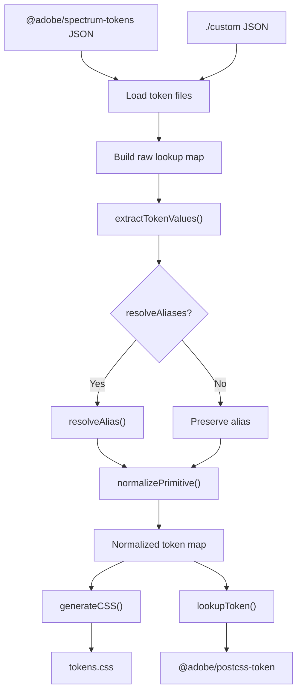
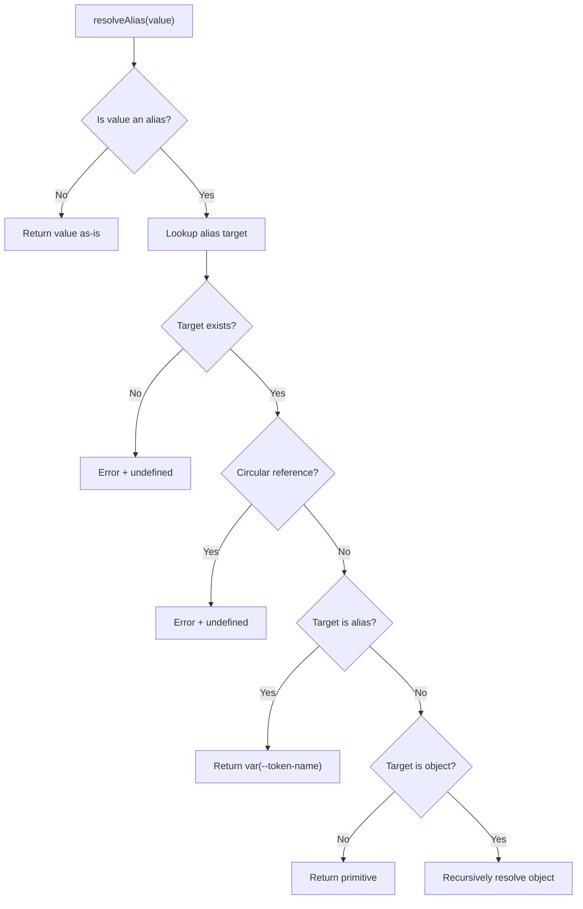
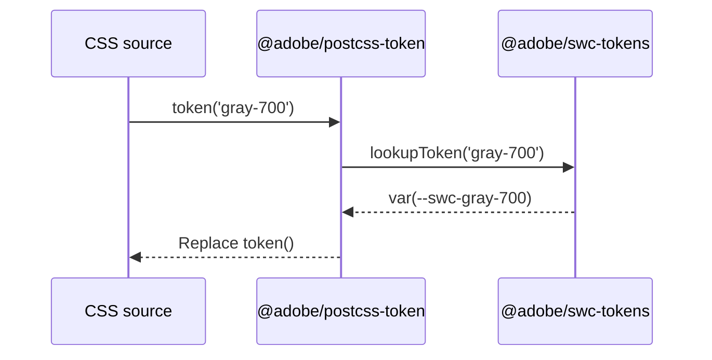

# @adobe/swc-tokens

This package ingests Spectrum design token source data and converts it into CSS custom properties and a unified stylesheet for use by `@adobe/swc` components.

An additional function, `lookupToken()`, is exported for use by `@adobe/postcss-token`. It powers the `token()` CSS function by resolving token names to either computed values or composed custom properties.

## Terminology

- **Token** – A named design value (e.g. `gray-500`)
- **Alias** – A reference to another token (`{gray-500}`)
- **Set** – A token with multiple contextual values (e.g. `light` / `dark`)
- **Resolved value** – A final primitive value
- **Custom property** – A CSS variable (`var(--swc-gray-500)`)

## Upon Token Data Update

> If you update either the `@adobe/spectrum-tokens` package version or modify custom tokens, you must do the following.

Ensure tokens are updated in the dependent packages by running the following command at the _root level_ of the repo:

```bash
yarn tokens:update
```

This will first run all token related tests, then update the extension-relative `tokens.json` for `swc-vscode-token` and the library-relative `tokens.css` for `@adobe/swc`.

If any test fails, the artifacts will not be generated, allowing you to investigate and fix any issues.

## Data Sources

Design token data is sourced from [@adobe/spectrum-tokens](https://www.npmjs.com/package/@adobe/spectrum-tokens) and the original [/tokens/src](https://github.com/adobe/spectrum-design-data/tree/main/packages/tokens/src) files.

> The source data from `@adobe/spectrum-tokens` is treated as read-only and is never modified directly.

### Custom Tokens and Overrides

Additional tokens may be added within `./custom` as JSON files in the following format:

```js
{
    // Primitive value only
    "animation-duration-0": {
        "value": "0ms"
    },
    // Value with embedded alias, marked by curly braces
    "serif-font-family-stack": {
        "value": "adobe-clean-serif, '{serif-font-family}', 'Source Serif Pro', Georgia, serif"
    },
    // Value of a token alias, with `skipResolution` flag to express alias as a custom property and not a resolved alias value
    "serif-font": {
        "value": "{serif-font-family-stack}",
        "skipResolution": true
    },
}
```

The `skipResolution` flag indicates that an alias **should remain an alias** and be emitted as a CSS custom property reference, rather than being resolved to its final primitive value.

If a new custom file is added, also include its name and whether to resolve aliases in the `CUSTOM_TOKENS` array in `utils.js`.

## Token and Alias Resolution

Tokens from `@adobe/spectrum-tokens` appear in different shapes. Some define a flat `value`, while others define a `sets` object (e.g. `light` / `dark`, `desktop` / `mobile`).

Token values may be:

- Static primitives (e.g. `16px`)
- Aliases referencing another token (e.g. `{gray-500}`)
- Composite values containing embedded aliases

At a high level:

1. All source JSON files are loaded
2. A global lookup table of raw token values is created
3. Tokens are normalized and aliases are resolved (or preserved) based on configuration
4. The final result is emitted as CSS custom properties or queried via `lookupToken()`

<details>
<summary>View Mermaid chart of token/alias flow</summary>



</details>

### Controlling Alias Resolution

Alias resolution is controlled per source file via configuration in `utils.js`. The `SPECTRUM_TOKENS` and `CUSTOM_TOKENS` lists the source JSON filenames and also flags files to either resolve found aliases or not.

Some sources intentionally preserve aliases to ensure correct composition across multiple token layers.

Additionally, resolution of `CUSTOM_TOKENS` can be managed per token, as described for [custom tokens and overrides](#custom-tokens-and-overrides).

### Alias Resolution Logic

<details>
<summary>View Mermaid chart of alias resolution</summary>



</details>

## Stylesheet Generation

The unified stylesheet splits tokens into two groups:

- non-scaling:
    - primitive values (`corner-radius-100`)
    - `light-dark()` eligible color tokens (`blue-800`)
    - values that never change across size scales
- scaling
    - tokens that composite medium and large values

The token groups are segmented into specific selectors in the final unified stylesheet:

```css
:root {
    /* Non-scaling values */
}

:root,
.spectrum-theme {
    /* Scaling values */
}
```

CSS computes custom property values at declaration time. For scale-aware tokens, their resolved values must be re-evaluated whenever a size context changes (for example, from medium to large).

By declaring scaling tokens under both `:root` and `.spectrum-theme`:

- Tokens remain available globally by default
- Consumers can locally override scale by applying `.spectrum-theme` plus a corresponding size class (e.g. `--spectrum-theme--sizeL`)

Without this structure, scaling tokens would not recompute correctly when applied within a scoped theme or size container.

### Updating the Tokens Stylesheet

If changes are made to the token data or processing, see ["Upon Token Data Update"](#upon-token-data-update) for how to update dependent packages, which includes regenerating the tokens stylesheet.

> Review stylesheet changes via git to ensure there are no regressions and that changes are expected.

## Function: `lookupToken()`

This function is provided primarily for use by `@adobe/postcss-token` and powers the custom PostCSS `token()` function.

It acts as a read-only query interface over the processed token map produced by this package.

### What `lookupToken()` Does

- Looks up a token by name after all normalization and alias resolution rules have been applied
- Returns the final CSS-safe value, which may be:
    - A resolved primitive (e.g. rgb(0 0 0))
    - A composed custom property (e.g. var(--swc-gray-700))
- Throws an error if the requested token does not exist or is not resolvable

> `lookupToken()` does not perform token parsing, normalization, or resolution itself. It only queries the already-processed token data.

<details>
<summary>View Mermaid diagram of lookupToken() flow</summary>



</details>

### What `lookupToken()` Does Not Do

- ❌ Does not read raw Spectrum or custom JSON files
- ❌ Does not resolve aliases dynamically
- ❌ Does not perform fallbacks or environment-specific logic
- ❌ Does not distinguish between light/dark or responsive sets at call time

All of those concerns are handled during the token generation phase.

### Why This Function Exists

`lookupToken()` provides a stable contract between token generation (`@adobe/swc-tokens`) and token consumption (`@adobe/postcss-token`):

- Token data is generated once
- Consumers only perform lightweight lookups
- All aliasing, composition, and validation remain centralized

This keeps runtime usage predictable and avoids re-implementing token logic in downstream tooling.

## CLI Options

The main package provides a CLI to produce either the unified stylesheet `tokens.css` or the dump of processed data as `tokens.json`.

> For purposes of the main package, those files are git ignored and intended for debugging purposes only.

For the primary consuming package `@adobe/swc`, the following CLI command is used:

```bash
swc-tokens --outputType stylesheet --out ./stylesheets/tokens.css --prefix swc
```

This outputs the stylesheet into the noted `--out` directory and filename, with the use of `swc` as a prefix for all custom properties.

> **Note**: The `--prefix` value must match with the `prefix` option for `@adobe/postcss-token`, if using.

Valid `--outputType` values include:

- `stylesheet`
- `tokens` - produces JSON

## Commands

These commands are primarily intended for local development and debugging of token changes.

The following command can be used in the main package to produce a debug log - `debug-tokens.txt`. By default, only errors will be logged. Add more `log()` statements as needed.

```bash
yarn debug:tokens
```

Generate commands are available to produce outputs like those available to consuming packages.

```bash
yarn generate:stylesheet
yarn generate:tokens
```

## Testing Changes

Tests cover alias resolution, set handling, custom overrides, and CSS output.

Tests are set up using [Vitest](https://vitest.dev/guide/), located in `./tests`.

```bash
yarn test
yarn test:watch
```

Additionally, you can run all token-package related tests at the _root level_ of the repo. This test command is also run at the start of `tokens:update`.

```bash
yarn tokens:test
```
