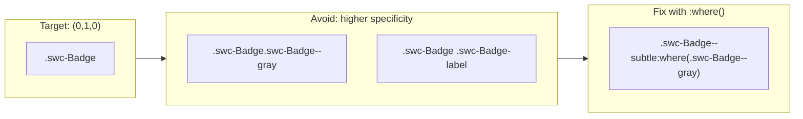

<!-- Generated breadcrumbs - DO NOT EDIT -->

[CONTRIBUTOR-DOCS](../../README.md) / [Style guide](../README.md) / [2nd-Gen CSS](README.md) / Component CSS

<!-- Document title (editable) -->

# Component CSS

<!-- Generated TOC - DO NOT EDIT -->

<details open>
<summary><strong>In this doc</strong></summary>

- [Contributor TL;DR](#contributor-tldr)
- [Rule Order](#rule-order)
- [CSS property ordering](#css-property-ordering)
- [Class naming patterns](#class-naming-patterns)
- [Comment conventions](#comment-conventions)
- [Selector patterns](#selector-patterns)
    - [When to use `:host`](#when-to-use-host)
    - [When to use `:host([attribute])`](#when-to-use-hostattribute)
    - [When to use classes vs attributes](#when-to-use-classes-vs-attributes)
    - [Managing specificity with `:where()`](#managing-specificity-with-where)
    - [Avoiding descendant selectors](#avoiding-descendant-selectors)
- [Variant implementation patterns](#variant-implementation-patterns)
- [State implementation patterns](#state-implementation-patterns)
- [Size variant patterns](#size-variant-patterns)
- [Animation and transition patterns](#animation-and-transition-patterns)
- [Forced colors requirements](#forced-colors-requirements)
- [Managing Specificity](#managing-specificity)
    - [Shadow DOM Specificity and Custom Property Inheritance](#shadow-dom-specificity-and-custom-property-inheritance)
    - [Using Cascade Layers (`@layer`)](#using-cascade-layers-layer)
- [Component Specs vs. Component Styles](#component-specs-vs-component-styles)
- [Color Themes](#color-themes)
    - [Modifying Non-Color Properties](#modifying-non-color-properties)
- [Closing Note for Contributors](#closing-note-for-contributors)

</details>

<!-- Document content (editable) -->

The following are high-level guidelines for the CSS creation for components.

## Contributor TL;DR

> For examples of all of these rules in practice, review [Badge](../../../2nd-gen/packages/swc/components/badge/badge.css) and [Status Light](../../../2nd-gen/packages/swc/components/status-light/status-light.css) as reference implementations, the [reference migration for Badge](04_spectrum-swc-migration.md#reference-migration-badge), and the [anti-patterns guide](05_anti-patterns.md).

- `:host` is for defining how the container participates in the global layout, not the core component styles
- Follow the prescribed rule order
- Strive to keep selector specificity ≤ `\(0,1,0\)` with [explicit management](#managing-specificity)
- Use variants and custom property exposure intentionally
- Prefer CSS layout primitives when applying component specs
- Introduce cascade layers if needed as a specificity controller, using the prescribed layer order
- Forced colors styles are only included when browser defaults are not sufficient

## Rule Order

Follow this outline for ordering rulesets within component stylesheets. This will provide consistency across component stylesheets, as well as help mitigate common specificity issues.

1. *If applicable*: `@layer` , `@keyframes`
2. `:host`
        - Considered as a "container" for the component, and should not directly manage component styles itself. Its only concern is how the web component participates in the layout.
        - Primarily includes a `display`  property to match the layout flow intent, using either `inline-block` or `block`
            - Avoid `inline` which would prevent consumers applying reasonable layout properties such as `margin`
        - May also include "defensive" styles for `inline-block` elements
            - `place-self: start` to avoid stretch behaviors if they are placed in a flex or grid context
            - `vertical-align: middle` to keep a vertically centered position next to other `inline-block` elements (ex. a row of badges outside of a flex or grid context)
3. `* { box-sizing: border-box; }`
    - Unless there is a strong reason not to, this rule should be included in all components. Expand to pseudo-elements if in use.
    - Required if the component or its descendants set  `padding` and/or `border` to avoid the compounding effect against the element's size.
4. component styles
    - base class: `.swc-ComponentName`
    - subcomponents: `.swc-ComponentName-sub-component`
    - t-shirt sizes: `:host([size="s"])`
        - Uses `:host()` to maintain exposure of size-related custom properties
    - other variants
        - generally ordered from lower-specificity simple selectors to compound selectors as part of specificity management
        - `.swc-ComponentName--variant` - used for variants excluded from custom property exposure
        - `:host([variant="value"])` - used for variants that should maintain custom property exposure
    - states: `:host([aria-expanded])` , `:host:focus-visible` , etc.
        - states should be attached to `:host/:host()` unless the WC expresses the state on internal elements
        - include within variant styles if needed for specificity reasons
    - `::slotted()` and `slot` styles
    - `@media (forced-colors: active)`
        - **First ensure that the styles are actually necessary**. Do not include styles if the browser defaults achieve visibility of critical component parts and states.
        - If needed, this media query should *always* be at the end of the stylesheet to take priority over other styles.
        - Use direct internal selectors, not host selectors, to enforce the style and prevent accidental consumer overrides.

Sizes, variants, and states should primarily modify the component via updating component custom property values. Refer to the [custom properties style guide](02_custom-properties.md).

## CSS property ordering

Inside each ruleset, order properties in a consistent way. This makes stylesheets easier to scan and reduces merge conflicts.

**Order**: Display → Position → Flex/Grid → Alignment → Dimensions → Spacing → Typography → Decoration → Overflow → User interface → Color adjustment → Generated content → SVG → Effects → Transforms → Transitions/Animations

For the full list and examples, see the [property order quick reference](06_property-order-quick-reference.md).

**Example from [Badge](../../../2nd-gen/packages/swc/components/badge/badge.css)**:

```css
.swc-Badge {
  display: inline-flex;
  gap: var(--swc-badge-gap, token("text-to-visual-100"));
  align-items: center;
  min-block-size: var(--swc-badge-height, token("component-height-100"));
  padding-block: calc(/* ... */);
  padding-inline: calc(/* ... */);
  color: var(--swc-badge-label-icon-color, token("white"));
  background: var(--swc-badge-background-color, token("accent-background-color-default"));
  border: var(--_swc-badge-border-width) solid var(--swc-badge-border-color, transparent);
  border-radius: var(--swc-badge-corner-radius, token("corner-radius-medium-size-medium"));
  cursor: default;
}
```

## Class naming patterns

Use these patterns so class names are predictable across components.

| Pattern                        | Purpose                        | Example                                              |
| ------------------------------ | ------------------------------ | ---------------------------------------------------- |
| `.swc-ComponentName`           | Base wrapper for the component | `.swc-Badge`, `.swc-StatusLight`                     |
| `.swc-ComponentName-part`      | Subcomponent or internal part  | `.swc-Badge-label`, `.swc-Badge-icon`                |
| `.swc-ComponentName--modifier` | Variant or state modifier      | `.swc-Badge--gray`, `.swc-Badge--fixed-inline-start` |

**Why**: Consistent naming helps contributors find and update styles. The `--` suffix signals a modifier that changes the base appearance.

**Example from [Badge](../../../2nd-gen/packages/swc/components/badge/badge.css)**:

```css
.swc-Badge { /* base */ }
.swc-Badge-label { /* text content */ }
.swc-Badge-icon { /* icon container */ }
.swc-Badge--fixed-inline-start { /* edge modifier */ }
.swc-Badge--gray { /* color variant */ }
```

**Example from [Status Light](../../../2nd-gen/packages/swc/components/status-light/status-light.css)**:

```css
.swc-StatusLight { /* base */ }
.swc-StatusLight--yellow { /* color variant */ }
```

## Comment conventions

Use comments to explain non-obvious choices. Keep them short and use sentence case.

**When to comment**:

- Section headers for long stylesheets (e.g. `/* Size variants */`)
- Non-obvious design decisions (e.g. why a token was chosen)
- Notes about spec or migration (e.g. `/* NOTE: accent is the default color */`)

**Style**:

- Use sentence case: `/* Adjust padding when icon is present */` not `/* Adjust Padding When Icon Is Present */`
- Use `/* NOTE: */` for important caveats
- Avoid comments that repeat what the code does

**Example from [Badge](../../../2nd-gen/packages/swc/components/badge/badge.css)**:

```css
/* NOTE: `accent` is the default color */

:host([variant="neutral"]) {
  --swc-badge-background-color: token("neutral-subdued-background-color-default");
}
```

## Selector patterns

Choose the right selector based on whether you need custom property exposure and how the component expresses state.

### When to use `:host`

Use `:host` only for layout participation. Do not put visual styles here.

```css
:host {
  display: inline-block;
  place-self: start;
  vertical-align: middle;
}
```

**Why**: `:host` is part of the public styling API. Visual styles here are harder to override. See [anti-pattern #1](05_anti-patterns.md#1-leaving-visual-styles-on-host).

### When to use `:host([attribute])`

Use `:host([attribute])` when the variant or state should expose custom properties for consumer overrides. See [variant implementation patterns](#variant-implementation-patterns) and [size variant patterns](#size-variant-patterns) for detailed examples.

**Why**: Consumers can override via `swc-badge[size="s"]` or `swc-badge[variant="negative"]`. Custom properties set on `:host` flow down to internal elements.

### When to use classes vs attributes

See [variant implementation patterns](#variant-implementation-patterns) for the full decision table. In short: `:host([attribute])` for exposed customization, `.swc-ComponentName--variant` for implementation details.

### Managing specificity with `:where()`

See [Managing Specificity](#managing-specificity) for full guidance. In short: wrap compounded class selectors in `:where()` to keep specificity at `(0,1,0)`.

### Avoiding descendant selectors

Prefer direct class selectors over deep descendant chains. Use `:has()` for conditional styling when needed.

```css
/* Prefer */
.swc-Badge:has(.swc-Badge-icon) {
  --swc-badge-padding-inline: var(--swc-badge-with-icon-padding-inline, token("component-edge-to-visual-100"));
}

/* Avoid deep nesting */
.swc-Badge .swc-Badge-icon ~ .swc-Badge-label { }
```

## Variant implementation patterns

Variants change how the component looks. Use the right selector based on customization intent of [custom property exposure](02_custom-properties.md#component-custom-property-exposure).

| Variant type       | Selector                                 | Example                                |
| ------------------ | ---------------------------------------- | -------------------------------------- |
| Size               | `:host([size="s"])`                      | Exposes `--swc-badge-height`, etc.     |
| Semantic color     | `:host([variant="positive"])`            | Exposes `--swc-badge-background-color` |
| Non-semantic color | `.swc-ComponentName--magenta`            | No exposure; implementation detail     |
| Static color       | `.swc-ComponentName--staticWhite`        | No exposure; ensures contrast          |
| Geometric          | `.swc-ComponentName--fixed-inline-start` | No exposure; layout modifier           |

**Example from [Badge](../../../2nd-gen/packages/swc/components/badge/badge.css)**:

```css
:host([variant="positive"]) {
  --swc-badge-background-color: token("positive-background-color-default");
}

.swc-Badge--magenta {
  --swc-badge-background-color: token("magenta-background-color-default");
}
```

## State implementation patterns

States reflect user interaction or component condition. Attach them to `:host` when the host element carries the state.

| State    | Selector                                  | Example             |
| -------- | ----------------------------------------- | ------------------- |
| Expanded | `:host([aria-expanded])`                  | Accordion, dropdown |
| Disabled | `:host([disabled])` or `:host(:disabled)` | Form controls       |
| Focus    | `:host:focus-visible`                     | Keyboard focus ring |
| Invalid  | `:host([invalid])`                        | Form validation     |

**Why**: States on `:host` let consumers style `swc-badge[disabled]` or `swc-badge:focus-visible`. If the state lives on an internal element, target that element directly.

**Note**: Badge and Status Light are non-interactive, so they do not define focus or disabled states. See interactive components (e.g. Button) for examples.

## Size variant patterns

Size variants (s, m, l, xl) use `:host([size="..."])` and update custom properties. Do not add size classes to `render()`.

**Example from [Status Light](../../../2nd-gen/packages/swc/components/status-light/status-light.css)**:

```css
:host([size="s"]) {
  --swc-statuslight-top-to-text: token("component-top-to-text-75");
  --swc-statuslight-height: token("component-height-75");
  --swc-statuslight-dot-size: token("status-light-dot-size-small");
  --swc-statuslight-font-size: token("font-size-75");
}
```

**Why**: Size is part of the customization surface. Consumers can override `swc-badge[size="l"] { --swc-badge-height: 48px; }`.

## Animation and transition patterns

Use `@keyframes` at the top of the file. Apply animations via custom properties or direct properties on the target element.

**Keyframes**: Define before other rules. Use a prefixed name to avoid clashes.

```css
@keyframes swc-fills-rotate {
  0% { transform: rotate(-90deg); }
  100% { transform: rotate(270deg); }
}
```

**Animation application**: Use on the element that animates. Include `will-change` only when it helps performance.

```css
.swc-ProgressCircle--indeterminate .swc-ProgressCircle-fill {
  animation: swc-fills-rotate 1s cubic-bezier(0.6, 0.1, 0.3, 0.9) infinite;
  will-change: transform;
}
```

**Example from [Progress Circle](../../../2nd-gen/packages/swc/components/progress-circle/progress-circle.css)**.

**Transitions**: Prefer design tokens for duration and easing. Use `transition` in the Transitions/Animations category of the property order.

## Forced colors requirements

Forced colors mode (Windows High Contrast, etc.) replaces colors with system values. Only add styles when browser defaults are not enough.

**Rules**:

1. **Check first**: Do not add forced-colors styles if the browser already makes the component visible.
2. **Place last**: Put `@media (forced-colors: active)` at the end of the stylesheet so it overrides other styles.
3. **Use internal selectors**: Target `.swc-ComponentName` or internal elements, not `:host`. This prevents accidental consumer overrides from breaking accessibility.
4. **Reuse custom properties**: Override component custom properties (e.g. `--swc-statuslight-content-color`) so the rest of the stylesheet still works.

**Example from [Status Light](../../../2nd-gen/packages/swc/components/status-light/status-light.css)**:

```css
@media (forced-colors: active) {
  .swc-StatusLight {
    --swc-statuslight-content-color: CanvasText;
    forced-color-adjust: none;

    &::before {
      border: token("border-width-100") solid;
    }
  }
}
```

**Why**: The dot uses `background-color`, which is replaced in forced-colors mode. Adding a border keeps it visible. `forced-color-adjust: none` lets the component control its appearance.

**Note**: Badge does not need forced-colors overrides because its default styles remain visible. Only add them when needed.

## Managing Specificity

Most components are scoped enough that following the prescribed rule order will avoid specificity clashes. However, in some cases such as compounded variants or variants plus states, selectors can still start to bump up specificity.

The issue with bumping up specificity is that it makes valid overrides - such as for a `:disabled` state - more challenging.

Try to keep specificity no greater than `(0,1,0)` which means a maximum of 1 class.



> - Learn [how specificity is calculated](https://developer.mozilla.org/en-US/docs/Web/CSS/Guides/Cascade/Specificity#how_is_specificity_calculated)
> - Test with a [specificity calculator](https://polypane.app/css-specificity-calculator/)

To keep specificity low, clauses beyond a single class can be wrapped in `:where()` which nulls the specificity of that clause to zero. Use of `:where()` is encouraged, has ample browser support, and will be expected in PR reviews for compounding class selectors.

```css
/* Before */
.swc-Divider--staticWhite.swc-Divider--sizeL

/* After */
.swc-Divider--staticWhite:where(.swc-Divider--sizeL) 
```

Reducing specificity in this way means the *order* of the rulesets takes precedence.

Occasionally, specificity bumping *is* necessary, but carefully evaluate the order of the rule first. Then, only add the most critical selectors to achieve the necessary specificity bump. Alternatively, consider cascade layers, as described next.

**Exceptions to max-specificity rule**:

- use of pseudo-classes and pseudo-elements (ex. `.spectrum-Button:hover`) are an acceptable bump to specificity, and should be applied outside of `:where()`
- compound attribute selectors in `:host()` are permissable, and most often should not use `:where()` as their computed value will be treated differently, as described next

### Shadow DOM Specificity and Custom Property Inheritance

When working in Shadow DOM, selector specificity does not always determine which custom property value wins.

This is because CSS custom properties are inherited, and their resolved value is determined by the nearest override in the inheritance chain, not by selector specificity alone.

As a result:

- An internal class selector that updates a custom property (e.g. `.swc-ComponentName--variant`)
- ...will override a `:host()` selector that updates the same custom property
- ...even if the `:host()` selector appears more specific

```html
<style>
    p {
      color: var(--color, blue);
    }
    
    .red {
      --color: red;
    }
    
    :host([purple]) {
      --color: purple;
    }
</style>

<p class="red">content</p>
```

Even when the host element has the [purple] attribute, the paragraph will render as red.

This happens because:

- `.red` applies the custom property directly on the element that consumes it
- `:host([purple])` applies the custom property higher in the inheritance chain
- the nearer override wins, regardless of selector specificity

In our real-world component styles, we would use a consistent selector application for these variants (based on custom property exposure intent, not visual similarity) which largely avoids clashes between these styles. And rule order should typically resolve variant vs. variant plus state compounded selectors, if applicable.

This is also why the system intentionally uses different selector types for variants:

- Variants expressed via `:host([…])` are part of the component’s **customization surface** and are expected to update custom property values.
- Variants expressed via internal classes (e.g. `.swc-ComponentName--variant`) are **implementation details** and are not intended to expose or preserve custom property overrides.

This distinction allows us to safely rely on custom property inheritance rules while keeping the public styling surface predictable.

Because of this inheritance behavior:

- It is safe to compound attribute selectors within `:host()`
- ...as long as those selectors are only modifying custom property values

In these cases, `:where()` should generally not be used inside `:host()`, since selector specificity is not the determining factor.

However:

- If you need to modify a direct CSS property (not a custom property),
- or there is no corresponding custom property available,

then the change should be made on the base component or subcomponent selector, as described in the [custom properties style guide](02_custom-properties.md).

### Using Cascade Layers (`@layer`)

> *[DRAFT] guidance - formal RFC in the works*

In more complex components that are juggling a lot of variants in coordination with states, you can introduce cascade layers. An indicator this may be the best course is extensive use of `:where()` to try to wrangle competing variant and state selectors.

The initial order layers are defined is the order they will remain, where the first listed layer has the lowest priority, and the last listed layer has the highest priority.

If you require layers, insert this rule at the top of your stylesheet.

```css
@layer swc-host, swc-component, swc-variants, swc-states, swc-slots;
```

> **Note**: Layer names are prefixed because although they are isolated and do not compound with light DOM-based layers, the prefix helps identify the correct layer source in browser dev tools.

This exact layer order should stay consistent anytime layers are introduced to maintain a more predictable implementation. Please keep each layer name as listed even if the layer isn't presently populated by the component.

Then, adjust styles into those layers, such as:

```css
@layer swc-host {
    :host {
        display: block;
    }
    
    * {
        box-sizing: border-box;
    }
}

@layer swc-component {
    .swc-Divider {
        /* ... */
    }
}
```

**Important notes about layers:**

- If you introduce layers, then *all* of the component's styles must be within a layer. This is because unlayered styles have the highest priority, and therefore beat all layered styles, which negates the benefit of introducing layers.
- Simple selectors such as `:disabled` can beat out classically higher-specificity selectors located in earlier layers. This is both useful, but also a potential foot-gun, and is the reason for the recommended layer order.
- Within a layer, specificity still matters, so in some cases you may still employ `:where()` to keep individual selector specificity reduced.
- It's possible to nest layers to further deprioritize a rule set since nested layers have *less* priority then un-nested layers.
  - Nested layers should be rare and require a clear justification; most components will never need them.
- Use of `!important` will invert the priority order to allow those styles to still take precedence, but proper use of layers should largely prevent the need for enforced importance.

## Component Specs vs. Component Styles

Component specs use design tokens to assign values to nearly all visual aspects of components.

Exempt from tokens but relevant to CSS are values for properties such as:
- `display` - intent is expressed via spec visuals, but not tokenized
- grid and flex alignment properties, ex. `align-items`
- `grid-template-` layout conditions

Often, specs will be very prescriptive about what equates to `padding` for an element. That padding may vary for scenarios such as between the top of the component to it's text label vs. from the top to an optional icon.

It is tempting to use those values as prescribed in order to match the specs. However, the `display` choice of `grid` or `flex` should be taken into account first.

For example:

- Prefer `gap` over overly prescriptive selectors that apply or remove margin
  - *Exception*: if using `grid-template-areas`, the `gap` will still exist even if the grid area is not populated, so `margin` may be more appropriate
- Prefer alignment properties in coordination with min/max sizes before overly prescribing `padding` values
  - *Example*: for Badge, there is a `min-block-size` and the specs provide different block padding values for an icon vs. a text label. By using flexbox and `align-items: center`, we only really need to set the *text-relative* block padding, which is more of a defense mechanism in case the badge label needs to wrap to prevent the text touching the component edge.
    - Badge also uses `:has()` to conditionally adjust padding when icons are present; this replaces Spectrum-era spacing rules.

The ultimate intent here is to prioritize working with the grain of CSS layout models.

## Color Themes

Spectrum supports a light and dark theme. Any tokens that represent colors that change per theme use the CSS function `light-dark()`. Therefore, most component styles only need to reference the appropriate color token and theme changes will be handled.

### Modifying Non-Color Properties

While not currently present in the system, should a need arise to change non-color properties (ex. `border-width`), those changes should be exposed as global tokens. Global tokens that are exclusive to SWC and not foundational token data can be added in the global 2nd-gen stylesheet, `swc.css`.

Non-color tokens that should relate to color themes should be nested within the corresponding theme classes. This example illustrates a mock token addition.

```css
:root,
.swc-theme--light {
    --swc-theme-border-width: 2px;
}

.swc-theme--dark {
    --swc-theme-border-width: 1px;
}

/* Adapts to user preference, so assign per preference query value */
.swc-theme--adaptive {
    @media (prefers-color-scheme: light) {
        --swc-theme-border-width: 2px;
    }

     @media (prefers-color-scheme: dark) {
        --swc-theme-border-width: 1px;
    }
}
```

## Closing Note for Contributors

If you feel like you’re:

- stacking selectors,
- adding `!important`,
- or fighting overrides

**pause and reconsider rule order or layers first**.

The system is designed so you rarely need more power than `(0,1,0)` and proper rule ordering.
