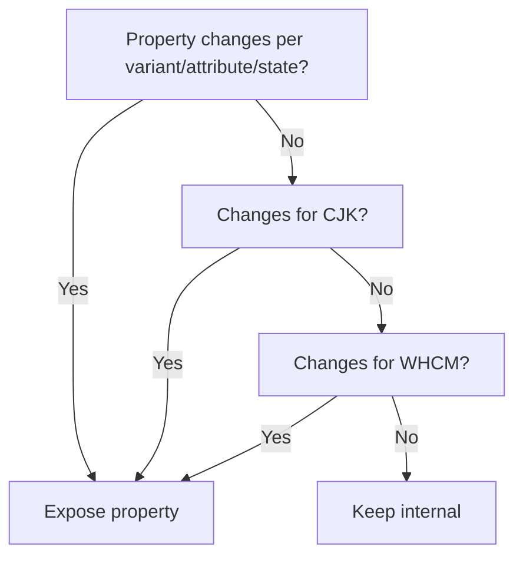

<!-- Generated breadcrumbs - DO NOT EDIT -->

[CONTRIBUTOR-DOCS](../../README.md) / [Style guide](../README.md) / [2nd-Gen CSS](README.md) / Custom Properties

<!-- Document title (editable) -->

# Custom Properties

<!-- Generated TOC - DO NOT EDIT -->

<details open>
<summary><strong>In this doc</strong></summary>

- [Naming Conventions](#naming-conventions)
- [Private Properties](#private-properties)
- [Component Custom Property Exposure](#component-custom-property-exposure)
    - [Internal vs. Exposed vs. Static](#internal-vs-exposed-vs-static)
    - [Decision Tree for Exposure](#decision-tree-for-exposure)
    - [Exclusions for Custom Property Overrides](#exclusions-for-custom-property-overrides)
- [Selector Conventions](#selector-conventions)
    - [Variant Selectors and Inheritance](#variant-selectors-and-inheritance)
- [Using `token()`](#using-token)
    - [Troubleshooting `token()`](#troubleshooting-token)
- [Adding Global Tokens](#adding-global-tokens)

</details>

<!-- Document content (editable) -->

This guide explains how to manage **private, internal, and exposed custom properties** in SWC components, and how to use `token()` to reference design tokens safely.

## Naming Conventions

| Prefix | Purpose |
|--------|---------|
| `_swc-*` | Private, internal custom property |
| `--swc-*` | Exposed property available for overrides |
| `token('name')` | Reference to a design token (no prefix) |

> Private properties are “pseudo-private”: defined on nested shadow elements rather than `:host` to prevent accidental overrides.

## Private Properties

- Used for **repeated**, **multi-value**, or **contextually updated** properties (themes, states, passthroughs)
- Always prepended with `_` to signal internal use
- Not directly overrideable by consumers

```css
.swc-Button {
    --_swc-button-background-color: /* value */;
}
```

CSS custom properties *normally* can't actually be "private". However, due to shadow DOM encapsulation, we can (partially*) enforce them as private by defining them on a nested wrapper within the component instead of on :host.

_*"partially" due to possible eventual exposure when we introduce parts_

## Component Custom Property Exposure

**Selector choice encodes API intent**: exposed properties are modified via `:host()`, while internal-only behavior is implemented with internal class selectors.

- Only expose component properties when needed by the component itself or for passthrough (nested) styling
- Exposed singularly based on CSS *property type*, and no longer based on states or variants
    - This distinction directly affects which selector type is used (`:host()` vs internal class selectors). See [Variant Selectors and Inheritance](01_component-css.md#shadow-dom-specificity-and-custom-property-inheritance).
- May be exposed via inclusion in private property, or inline with CSS property
    - Include in private property if value has repeated usage throughout base (non-variant) component styles
- In migrated components, legacy `--mod-* `properties should not be preserved; instead, collapse the chain into a single component-level property.

### Internal vs. Exposed vs. Static

| Type     | Definition                | Example                       |
| -------- | ------------------------- | ----------------------------- |
| Internal | Only via `_` or `token()` | `--_swc-button-padding-block` |
| Exposed  | Allows consumer overrides | `--swc-button-font-size`      |
| Static   | Non-tokenized, fixed CSS  | `display: inline-flex`        |

Static properties are not part of the customization surface and are not expected to change across variants, states, or contexts.

```css
.swc-Button {
    /* Changes per size variant = exposed */
    font-size: var(--swc-button-font-size, token('font-size-200'));
    
    /* Changes per size variant = exposed,
       Multi-value definition = private */
    --_button-padding-block:  
        token('component-top-to-text-100') token('component-bottom-to-text-100');
    padding-block: var(--swc-button-padding-block, 
                        var(--_button-padding-block));
    
    /* Does not change = internal
       Future parts will offer ability to modify */
    min-inline-size: token('button-minimum-width-multiplier');
    
    /* Non-tokenized CSS properties = static */
    display: inline-flex;
}

/* Library style for component "large" variant via :host() selector to maintain consumer override capability */
:host([size="l"]) {
    --swc-button-font-size: token('font-size-400');
    --swc-button-padding-block: 
        token('component-top-to-text-200') token('component-bottom-to-text-200');
}

/* Consumer override */
sp-button[size="l"] {
    --swc-button-font-size: var(--swc-font-size-500);
}
```

### Decision Tree for Exposure



> For **nested component relationships**, expose only if dependent on the base library and _not_ legacy consumer customization.

For examples of exposed vs internal properties applied via selectors, see:
- [Selector Conventions](#selector-conventions)
- [Variant Selectors and Inheritance](01_component-css.md#shadow-dom-specificity-and-custom-property-inheritance)

### Exclusions for Custom Property Overrides

There are some exclusions as to what should be exposed for overrides:

- color properties for static white and static black variants
    - ensures intent of color contrast
- color properties when tied to non-semantic color palette variants
    - *example*: the `magenta` variant of Badge
    - consumers will be encouraged to instead add a global override to re-assign those color values instead
- certain geometric variants (e.g. fixed-edge Badge) intentionally override exposed properties, such as corner radius
- properties modified for forced-colors mode
    - ensures forced-colors related overrides take precedence over consumer overrides for base component
    - forced-colors overrides are applied at the end of the component stylesheet. See the forced-colors section in the [Component CSS Style Guide](01_component-css.md).

Use internal selectors (ex. `.swc-Badge--magenta` ) to pass library overrides for these exclusions.

## Selector Conventions

Exposed properties **require** `:host()` to maintain override capability:

```css
:host([size='s']) {
    --swc-badge-height: token('component-height-75');
}
```

Consumers can then override exposed properties based on attributes and states:

```css
swc-button[size='s']
swc-button[aria-expanded]
swc-button:focus-visible
```

### Variant Selectors and Inheritance

Refer to the [Component CSS Style Guide](01_component-css.md#shadow-dom-specificity-and-custom-property-inheritance) for more details about variant selectors and how they are impacted by custom property inheritance.

## Using `token()`

- Provides dynamic resolution from design tokens
- Can be used as full or partial values in CSS
- Require a token name without the prefix

Use of `token()`  in CSS values such as the following:

```css
.swc-Button {
    background-color: token('accent-background-color-default');
}
```

Will be transformed at build time into valid CSS values:

```css
.swc-Button {
    background-color: var(--swc-accent-background-color-default);
}
```

More examples and further information on how `token()` retrieves and processes token data can be found in the README for `@adobe/postcss-token` ( `swc/tools/postcss-token` ).

### Troubleshooting `token()`

| Error               | Cause                    | Action                                                    |
| ------------------- | ------------------------ | --------------------------------------------------------- |
| `token() not found` | Typo, prefix, deprecated | Remove prefix, check spelling, consult `debug-tokens.txt` |
| Invalid token value | Cannot resolve to CSS    | Verify against S2 Token Specs; possibly add as custom global token |

- Debug log: `yarn debug:tokens` (from `@adobe/swc-tokens`)
- Deprecated tokens are logged with `[DEPRECATED]`

## Adding Global Tokens

Additional global tokens or token overrides may be necessary if values are unique to SWC, and not available - currently or planned - in the design token source package, `@adobe/spectrum-tokens` .

Examples of current custom global tokens include global animation transition timings and web-friendly font stacks.

Adding global tokens means that they can be accessed via `token()` and included correctly within the unified stylesheet for downstream consumer use as well.

For instructions on adding global tokens, refer to "Custom Tokens and Overrides" in the README for `@adobe/swc-tokens` (`swc/tools/swc-tokens`).
