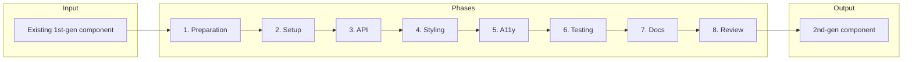

<!-- Generated breadcrumbs - DO NOT EDIT -->

[CONTRIBUTOR-DOCS](../../../../README.md) / [Project planning](../../../README.md) / [Workstreams](../../README.md) / [2nd-gen Component Migration](../README.md) / Step By Step / Washing machine: migrating an existing 1st-gen component to 2nd-gen

<!-- Document title (editable) -->

# Washing machine: migrating an existing 1st-gen component to 2nd-gen

<!-- Generated TOC - DO NOT EDIT -->

<strong>In this doc</strong>

    - [Workspace setup](#workspace-setup)
- [Quick Migration Checklist](#quick-migration-checklist)
- [Relationship to this workstream](#relationship-to-this-workstream)
- [Workflow overview](#workflow-overview)
- [Starting from 1st-gen (reference, not dependency)](#starting-from-1st-gen-reference-not-dependency)
- [Core vs SWC: where does code go?](#core-vs-swc-where-does-code-go)
- [Phase 1: Preparation](#phase-1-preparation)
    - [What to do](#what-to-do)
    - [What to check](#what-to-check)
    - [Common problems and solutions](#common-problems-and-solutions)
    - [Quality gate](#quality-gate)
- [Phase 2: Setup](#phase-2-setup)
    - [What to do](#what-to-do)
    - [What to check](#what-to-check)
    - [Common problems and solutions](#common-problems-and-solutions)
    - [Quality gate](#quality-gate)
- [Phase 3: API migration](#phase-3-api-migration)
    - [What to do](#what-to-do)
    - [Property migration scenarios](#property-migration-scenarios)
    - [API patterns (statics and warnings)](#api-patterns-statics-and-warnings)
    - [What to check](#what-to-check)
    - [Common problems and solutions](#common-problems-and-solutions)
    - [Quality gate](#quality-gate)
- [Phase 4: Styling](#phase-4-styling)
    - [What to do](#what-to-do)
    - [What to check](#what-to-check)
    - [Common problems and solutions](#common-problems-and-solutions)
    - [Quality gate](#quality-gate)
- [Phase 5: Accessibility](#phase-5-accessibility)
    - [What to do](#what-to-do)
    - [What to check](#what-to-check)
    - [Common problems and solutions](#common-problems-and-solutions)
    - [Quality gate](#quality-gate)
- [Phase 6: Testing](#phase-6-testing)
    - [What to do](#what-to-do)
    - [What to check](#what-to-check)
    - [Common problems and solutions](#common-problems-and-solutions)
    - [Quality gate](#quality-gate)
- [Phase 7: Documentation](#phase-7-documentation)
    - [What to do](#what-to-do)
    - [What to check](#what-to-check)
    - [Common problems and solutions](#common-problems-and-solutions)
    - [Quality gate](#quality-gate)
- [Phase 8: Review](#phase-8-review)
    - [What to do](#what-to-do)
    - [Final checklist (copy and use)](#final-checklist-copy-and-use)
    - [Quality gate](#quality-gate)
- [Decision trees](#decision-trees)
    - [Should this component be split into multiple components?](#should-this-component-be-split-into-multiple-components)
    - [Should this component be combined with another?](#should-this-component-be-combined-with-another)
    - [What shared utilities can be extracted?](#what-shared-utilities-can-be-extracted)
    - [How should variants be implemented?](#how-should-variants-be-implemented)
    - [What accessibility pattern applies?](#what-accessibility-pattern-applies)
- [Reference: Badge migration](#reference-badge-migration)
- [Style guides and resources](#style-guides-and-resources)

<!-- Document content (editable) -->

**Scope:** This guide applies **only** when a **1st-gen Spectrum Web Component already exists** (or 1st-gen is explicitly the package you are migrating—you refactor that surface, move shared logic to core, then add 2nd-gen). **Greenfield / net-new** 2nd-gen (no 1st-gen counterpart) is **out of scope** here; see [TODO: Greenfield 2nd-gen contributor guide](../03_migration-project-planning.md#todo-greenfield-2nd-gen-contributor-guide) in [Migration project planning](../03_migration-project-planning.md).

It **orchestrates** the migration: eight phases with checklists and quality gates, plus links to the step-by-step docs and style guides for implementation detail. It does not duplicate those guides—it sequences **what** to do and **when**.

### Workspace setup

Keep **spectrum-web-components** (this repo) and **[spectrum-css](https://github.com/adobe/spectrum-css)** in the **same workspace**—typically as **sibling folders** under one parent directory (e.g. `~/dev/spectrum-web-components` and `~/dev/spectrum-css`). Step 1 analysis, Phase 4 styling (S2 source from the spectrum-css **`spectrum-two`** branch), and AI-assisted migration prompts all work best when both trees are available locally for comparison, copy-from-source, and editor/IDE context.

---

## Quick Migration Checklist

**Before starting a migration:**

- [ ] **spectrum-css** is in the same workspace as this repo (sibling checkout; use **`spectrum-two`** for S2 CSS) → [Workspace setup](#workspace-setup)
- [ ] Component analysis exists → [Phase 1: Preparation](#phase-1-preparation)
- [ ] Breaking changes documented → [Phase 1: Preparation](#phase-1-preparation)
- [ ] Core folder created → [Phase 2: Setup](#phase-2-setup)
- [ ] SWC folder created → [Phase 2: Setup](#phase-2-setup)

**Migration steps:**

- [ ] Move base class to core → [Phase 2: Setup](#phase-2-setup)
- [ ] Create SWC component → [Phase 2: Setup](#phase-2-setup)
- [ ] Migrate public API → [Phase 3: API migration](#phase-3-api-migration)
- [ ] Migrate CSS (and run stylelint—property order, no-descending-specificity, tokens) → [Phase 4: Styling](#phase-4-styling)
- [ ] Implement accessibility → [Phase 5: Accessibility](#phase-5-accessibility)
- [ ] Add tests (test stories + a11y spec) → [Phase 6: Testing](#phase-6-testing)
- [ ] Add stories → [Phase 7: Documentation](#phase-7-documentation)
- [ ] Open PR → [Phase 8: Review](#phase-8-review)

---

## Relationship to this workstream

Use this doc for **what order** to do things and **what to check**; use the linked docs for **how to do** each phase.

- **Workstream:** [2nd-gen Component Migration](../README.md) — README, status table, and **7 step-by-step docs** that describe the migration path (study 1st-gen, create base in core, build 2nd-gen).
- **Status table:** [01_status.md](../01_status.md) — use it to see which components have completed which steps and to **update progress** when you finish a migration.
- **Jira / Epics:** [Migration project planning — Epics and tickets](../03_migration-project-planning.md) — epic templates, phase-aligned tickets, tracking.

**How the 8 phases map to the 7 step-by-step docs:**

| Washing machine phase | Step-by-step doc(s) |
|----------------------|---------------------------|
| **1. Preparation** | Uses output of **Step 1: Analyze rendering and styling** (read the component analysis). Plan breaking changes and scope. |
| **2. Setup** | **Steps 2–3** — study 1st-gen structure, create base class in core — then create 2nd-gen core/SWC layout per Phase 2. |
| **3. API migration** | **Step 4: Formalize Spectrum data model** + **Step 5: Add 2nd-gen SWC** (API overrides/additions). |
| **4. Styling** | **Step 6: Migrate rendering & styles from Spectrum CSS**. |
| **5. Accessibility** | (No dedicated step — this guide adds it.) |
| **6. Testing** | (Mentioned in steps as "confirm tests pass" — this guide makes it a full phase.) |
| **7. Documentation** | **Step 7: Add stories for 2nd-gen component** + JSDoc and usage docs. |
| **8. Review** | (No dedicated step — this guide adds checklist and PR.) |

Reference to guide to [understand the 1st-gen component structure](../02_step-by-step/02_factor-rendering-out-of-1st-gen-component.md) and the linked step-by-step docs for Steps 2–3. If those steps are **already** done, start **Phase 2** at SWC package setup and the Phase 2 “What to do” list.

---

## Workflow overview

---

## Starting from 1st-gen (reference, not dependency)

This workflow assumes a **1st-gen package** (`1st-gen/packages/<component>/` or equivalent) exists and serves as the **reference implementation**. You use it to understand the component's API, behavior, and edge cases — but neither generation imports from or depends on the other at runtime.

The approach:

1. **Study the 1st-gen implementation** — understand the public API, mixins, controllers, and rendering.
2. **Create the 2nd-gen base class in core** — start from the 1st-gen logic, applying improvements incrementally. Do not speculatively rewrite — changes should be informed by existing bugs, accessibility considerations, or feature disparity.
3. **Create the 2nd-gen concrete class in SWC** — add rendering, styles, and element registration.

1st-gen remains self-contained. It is **not** updated to import from 2nd-gen core.

---

## Core vs SWC: where does code go?

Before you start, know the split:

| Layer | Location | Contains |
|-------|----------|----------|
| **Core** | `2nd-gen/packages/core/components/<name>/` | Behavior, API, validation. Base class, types, mixins. **No** rendering. |
| **SWC** | `2nd-gen/packages/swc/components/<name>/` | Rendering, styling, element registration. Extends core base; adds `render()`, CSS, stories. |

- **Base class (core):** Properties, getters/setters, lifecycle, validation. Use `@internal` for non-public API.
- **Concrete class (SWC):** `extends` the base; adds `styles`, `render()`, and any SWC-only props (e.g. S2-only options).
- **Types:** In core (e.g. `Badge.types.ts`) for use by the concrete class and consumers.

File layout

- Core: `Component.base.ts`, `Component.types.ts`, `index.ts`
- SWC: `Component.ts`, `component.css`, `index.ts`, `stories/`, `test/`

---

## Phase 1: Preparation

**Goal:** Understand the component and plan the migration—including **API and naming** choices that should be agreed before heavy refactors.

### What to do

1. **Read or generate the component analysis** — See [Step 1: Analyze rendering and styling](01_analyze-rendering-and-styling/README.md). Analysis docs live under [03_components/](../../../03_components/) (e.g. `badge/rendering-and-styling-migration-analysis.md`). Have **spectrum-css** in the [same workspace](#workspace-setup) so comparisons to Spectrum 2 source are practical. **Optional (AI-assisted):** If you use Cursor, the **component-migration-analysis** skill (when available in your setup) can be used together with Step 1’s [Cursor prompt](01_analyze-rendering-and-styling/README.md#using-the-cursor-prompt) to produce or update the analysis; still follow Step 1 QA before treating the doc as final.
2. **Read the 1st-gen code** and dependencies (mixins, shared modules).
3. **List breaking changes** and existing bug tickets; consider severity and whether fixes require breaking changes.
4. **Write a short migration plan** — scope, risks, order of work. A reusable template is available at [`.ai/skills/migration-prep/assets/migration-prep-template.md`](../../../../../../.ai/skills/migration-prep/assets/migration-prep-template.md); copy it to `CONTRIBUTOR-DOCS/03_project-planning/03_components/[component]/migration-plan.md` before editing so the relative links resolve correctly.
5. **Capture API washing / naming cleanup in the plan** — Note alignment with **React Spectrum** where relevant, **Figma** option names, possible **splits** (e.g. menu vs listbox), and **overlay / event** conventions (`sp-opened`, `sp-closed`, which components may emit them); **get team review on the plan before large refactors** so downstream phases stay aligned.

### What to check

- [ ] I know the full public API (attributes, properties, slots, events).
- [ ] I know all the bugs that exist for this component in JIRA and am familiar with their severity and potential for breaking changes.
- [ ] I know which parts are S1-only vs S2-only (if both exist).
- [ ] I have a list of files to create in core and SWC.

### Common problems and solutions

| Problem | Solution |
|--------|----------|
| No component analysis doc | Use Badge as reference; run the Analyze step Cursor prompt to generate one, or compare 1st-gen vs 2nd-gen structure. |
| Existing 1st-gen bugs | Consider severity, whether fixes require breaking changes, etc., before deciding how to proceed. |
| Many variants or modes | Plan decision tree: one component vs several (see Decision trees below). |

**Stop and ask:** Should this be one component or several?

Use the decision tree under **Decision trees** below. If the answer is "split," agree with the team on the new component names and APIs before Phase 2.

### Quality gate

- [ ] Migration plan is written and covers: API surface, breaking changes, file layout (core vs SWC), and (where applicable) naming/split/overlay-event decisions—with **team review** before major refactors.

---

## Phase 2: Setup

**Goal:** Create the 2nd-gen file and folder structure (or finish the refactor path: base in core, 2nd-gen SWC created).

### What to do

1. **Core:** Create `2nd-gen/packages/core/components/<name>/` with `Component.base.ts`, `Component.types.ts`, `index.ts`.
2. **SWC:** Create `2nd-gen/packages/swc/components/<name>/` with `Component.ts`, `component.css`, `index.ts`, `stories/`, `test/`.
3. **Wire up exports** in `index`/`package.json` so the component is importable.

See [Step 2](02_factor-rendering-out-of-1st-gen-component.md) and [Step 3](03_move-base-class-to-2nd-gen-core.md) for directory layout, code structure, and reference implementations (Badge).

### What to check

- [ ] Core base class extends the right mixins (e.g. `SizedMixin`, `SpectrumElement`).
- [ ] SWC class extends the core base (e.g. `extends BadgeBase`).
- [ ] Imports resolve; build passes with minimal or stub implementation.

### Common problems and solutions

| Problem | Solution |
|--------|----------|
| Wrong base or mixin | See Badge and [Step 2](02_factor-rendering-out-of-1st-gen-component.md). |
| CSS not applied | Add `static override get styles()` and import the CSS module. See Badge. |
| Package not exporting | Add to package exports (e.g. `@adobe/spectrum-wc/badge`). |

### Quality gate

- [ ] All files exist; `nx build` (or equivalent) for the affected packages succeeds; component is importable in Storybook.

---

## Phase 3: API migration

**Goal:** Define properties, methods, and types in 2nd-gen (using 1st-gen as reference); keep a clear public API.

### What to do

1. **List the public API** from 1st-gen (attributes, properties, slots, events).
2. **Define types** in `Component.types.ts`; put shared API in base (core), SWC-only in concrete class.
3. **Mark internal API** with JSDoc `@internal`; add JSDoc for public props/slots.
4. **Implement static readonly arrays and debug warnings** — follow [API patterns (statics and warnings)](#api-patterns-statics-and-warnings) below; reference implementation: 2nd-gen Badge (`Badge.base.ts`, `Badge.ts`).

### Property migration scenarios

| Scenario | Where it goes | Action |
|----------|---------------|--------|
| **Same in S1 and S2** | Base (core) | Carry over from 1st-gen reference. |
| **Renamed in S2** | Base (core) with new name | Use the new name directly. No need to maintain the old name. |
| **Removed in S2** | Do not migrate | Document removal in component README. |
| **New in S2** | Base or SWC | Put in base if it's behavior; SWC if it's rendering-only. |

See [Step 4](04_formalize-spectrum-data-model.md) and [Step 5](05_implement-2nd-gen-component.md) for types, base vs SWC API, and native input handling (Checkbox).

### API patterns (statics and warnings)

Follow team **TypeScript conventions (Ticket 7)** for naming and structure; use **Badge** as the concrete reference.

**Static `readonly` arrays (`VARIANTS`, `VARIANTS_COLOR`, `VALID_SIZES`, `FIXED_VALUES`, etc.)**

- Declare canonical option lists in `Component.types.ts` as const arrays; the **base** exposes `static readonly` fields that concrete classes can override with their own valid values. This keeps the base abstract — validation uses `(this.constructor as typeof Base).VARIANTS` at runtime, so it automatically applies the correct set for whichever concrete class is running (including potential future rendering layers).
- Use them for: **runtime validation** (e.g. in `update()` or setters—check value is in the list), **Storybook** `argTypes` `options`, and **tests** (assert against the same source of truth).
- See `2nd-gen/packages/core/components/badge/Badge.base.ts` and `2nd-gen/packages/swc/components/badge/Badge.ts`.

> **When to skip class statics:** If the concrete class is a leaf that is not intended to be subclassed with different valid values, adding `static readonly VARIANTS = BUTTON_VARIANTS` to the class would simply re-point a module-level constant. In that case, referencing the module constant directly in debug/validation code is simpler — and avoids the `(this.constructor as typeof Base).VARIANTS` cast entirely. See `swc-button` (`Button.ts`) as an example: its `update()` references `BUTTON_VARIANTS` and `BUTTON_FILL_STYLES` directly rather than hoisting them as statics.

**`window.__swc.warn()` (debug-only)**

- When `window.__swc?.DEBUG` is enabled, warn on invalid API combinations (e.g. incompatible variant + outline) so developers catch mistakes without affecting production. See `Badge.base.ts` (`update()` and `window.__swc.warn(...)` with structured issue metadata).

**Deprecating 1st-gen type and const exports**

While 1st-gen does not import from 2nd-gen core, we still want to guide 1st-gen consumers toward patterns that will ease their eventual migration to 2nd-gen:

- Prefer **statics on the custom element class** over package-level exports for variant lists and related constants (`Component.VARIANTS`, etc.).
- For **types**, deprecate standalone type exports from 1st-gen packages and document migration to inference from the element (e.g. `typeof Badge.prototype.variant`, `typeof Badge.FIXED_VALUES`) — see `@deprecated` JSDoc on exports in `1st-gen/packages/badge/src/Badge.ts`.
- Use `window.__swc.warn()` in 1st-gen to surface deprecation notices at dev time when deprecated APIs are used.

### What to check

- [ ] All relevant 1st-gen props have a 2nd-gen home (base or SWC).
- [ ] Types are in core and used by SWC.
- [ ] Internal helpers are marked `@internal`.
- [ ] Static `readonly` arrays match types; used for validation, Storybook, and tests where applicable.
- [ ] Invalid prop combinations emit `window.__swc.warn()` when debug is on (where the component has combination rules).

### Common problems and solutions

| Problem | Solution |
|--------|----------|
| Different options from 1st-gen | Define const arrays in types; base uses canonical set; SWC overrides if needed. See Badge. |
| Complex getter/setter | Use only for attribute sync or validation; otherwise `@property`. |
| Native `<input>` (Checkbox) | See `Checkbox.base.ts` and `Checkbox.ts` for abstract `inputElement`, `handleChange`, `delegatesFocus`. |

**Stop and ask:** Breaking API changes

If you are renaming or removing a public prop or attribute, confirm with the team and plan deprecation or a migration path for consumers.

### Quality gate

- [ ] Public API is documented; types are in core; base holds behavior; SWC holds rendering.
- [ ] Static readonly pattern, debug warnings, and 1st-gen deprecation notices align with Badge (or equivalent) and TypeScript conventions (Ticket 7).

---

## Phase 4: Styling

**Goal:** Migrate CSS to 2nd-gen structure and follow the CSS style guide. Follow the [full migration steps](../../../../02_style-guide/01_css/04_spectrum-swc-migration.md); see also [Step 6: Migrate rendering & styles from Spectrum CSS](06_migrate-rendering-and-styles.md) for workstream context. Requires a local **spectrum-css** checkout next to this repo—see [Workspace setup](#workspace-setup).

### What to do

1. **Follow the migration steps** — [Step 6](06_migrate-rendering-and-styles.md) and the [full migration steps](../../../../02_style-guide/01_css/04_spectrum-swc-migration.md). Use [03_components/](../../../03_components/) for spectrum-two alignment. Copy S2 styles from your **spectrum-css** clone, **`spectrum-two`** branch, component `index.css` (not `dist`).
2. **Use tokens** — Replace hard-coded values with `token(...)`. Follow [component CSS](../../../../02_style-guide/01_css/01_component-css.md) and [custom properties](../../../../02_style-guide/01_css/02_custom-properties.md).
3. **Run stylelint** — After updating CSS, run `nx run swc:lint`. Fix all errors. The 2nd-gen config enforces: **property order** (see `linters/stylelint-property-order.js`); **no descending specificity** (e.g. `:host([disabled])` before `:host([checked][disabled])`); **declaration empty line** (empty line between groups); **token usage** (`token("...")` for color, font-size, etc.).

For templates, `render()`, icons (inline SVG), and detailed examples, see [Step 6](06_migrate-rendering-and-styles.md) and the [full migration steps](../../../../02_style-guide/01_css/04_spectrum-swc-migration.md).

### What to check

- [ ] No inline styles for theme/size; use CSS and classes.
- [ ] Tokens and custom properties align with Spectrum 2.
- [ ] Follows the [full migration steps](../../../../02_style-guide/01_css/04_spectrum-swc-migration.md).
- [ ] Adheres to the [component styling guidelines](../../../../02_style-guide/01_css/01_component-css.md).
- [ ] **2nd-gen CSS passes stylelint:** No `order/properties-order`, `no-descending-specificity`, `declaration-empty-line-before`, or token-usage errors in the component’s `.css` file (run `nx run swc:lint` or the repo’s lint command).

### Common problems and solutions

For troubleshooting and detailed patterns (e.g. 1st-gen Constructable Stylesheets vs plain `.css`, variant classes, size/density), see the [full migration steps](../../../../02_style-guide/01_css/04_spectrum-swc-migration.md) and [component styling guidelines](../../../../02_style-guide/01_css/01_component-css.md).

| Problem | Solution |
|--------|----------|
| `order/properties-order` errors | Reorder declarations to match `linters/stylelint-property-order.js` (e.g. display → position → flex → box sizing → margin → font → overflow → pointer-events → content → opacity → transition). |
| `no-descending-specificity` errors | Place lower-specificity selectors before higher-specificity ones (e.g. `:host([disabled])` before `:host([checked][disabled])`; single-attribute or single-pseudo before compound selectors). Split rule blocks if needed so order is consistent. |
| Token / `declaration-strict-value` | Replace hard-coded colors, font-size, etc. with `token("...")`. |

### Quality gate

- [ ] Follows the [full migration steps](../../../../02_style-guide/01_css/04_spectrum-swc-migration.md).
- [ ] Adheres to the [component styling guidelines](../../../../02_style-guide/01_css/01_component-css.md).
- [ ] Stylelint passes for the component’s CSS (no 2nd-gen CSS lint errors).

---

## Phase 5: Accessibility

**Goal:** Implement WCAG-aligned behavior and document it. Follow the repo’s [Accessibility testing](https://github.com/adobe/spectrum-web-components/blob/main/CONTRIBUTOR-DOCS/01_contributor-guides/09_accessibility-testing.md) guide and the PR template’s accessibility checklist; for public-facing usage, refer to the [public docs site](https://opensource.adobe.com/spectrum-web-components/) accessibility guidance where applicable.

### What to do

1. **Follow the [Accessibility testing](https://github.com/adobe/spectrum-web-components/blob/main/CONTRIBUTOR-DOCS/01_contributor-guides/09_accessibility-testing.md) guide** and the PR template checklist.
2. **Use 2nd-gen Storybook accessibility guides:** `2nd-gen/packages/swc/.storybook/guides/accessibility-guides/` — codebase-specific a11y patterns and docs surfaced in Storybook (complement the contributor guide and APG).
3. **Identify the APG pattern** for your component type (e.g. button, combobox) — [WCAG ARIA Authoring Practices Guide (APG)](https://www.w3.org/WAI/ARIA/apg/patterns/).
4. **Implement:** Semantics (prefer native HTML), ARIA where needed, keyboard support, focus management (trap in overlays), screen reader exposure. Test with assistive tech; document in JSDoc.
5. **Native vs custom controls:** Native form control (e.g. Checkbox) → `delegatesFocus: true`. Custom control (e.g. Radio) → `role` and `aria-*` on host, manage focus/keyboard. See Checkbox and Radio as references.
6. **Focus delegation on internal control:** When a component wraps a native form control inside its shadow DOM, `delegatesFocus: true` should be set in `createRenderRoot()` so that focus lands on the internal control, not the host. This belongs in the base class if all subclasses share the same host-wraps-native-control structure.
7. **Accessible name forwarding:** Attributes like `aria-label` on the host do not automatically apply to the internal control — either bind them explicitly in the render template (e.g. `aria-label=${this.getAttribute('aria-label')}`) or derive the accessible name in a protected helper and forward it. See `ButtonBase.getResolvedAccessibleName()` as a reference. Note that implementing these patterns may require adding methods or modifying the render template, so Phase 5 often touches component class files, not only Storybook or docs.

### What to check

- [ ] ARIA and semantics match the chosen APG pattern.
- [ ] Component behaves as expected with screen reader. 
- [ ] Keyboard and focus behavior are implemented and tested.
- [ ] No accessibility regressions vs 1st-gen.

### Common problems and solutions

| Problem | Solution |
|--------|----------|
| Unclear which pattern applies | Start from the component's primary role (e.g. "combobox" → Combobox pattern). Consider splitting into more than one component (e.g. "sp-menu" into menu and listbox components). |
| Focus trap in overlays | Use a shared focus-trap utility if the repo provides one; follow APG for modal/dialog. |
| Custom controls | Ensure they have roles, names, and keyboard support; avoid div/span without semantics. |

**Stop and ask:** Custom events vs native events

Prefer native events when they give the right semantics (e.g. `click`). Add custom events only when you need to expose extra data or lifecycle (e.g. `sp-close`). Document both in JSDoc.

### Quality gate

- [ ] APG pattern identified and linked
- [ ] Keyboard and ARIA implemented
- [ ] a11y tests added
- [ ] Screen reader testing performed

---

## Phase 6: Testing

**Goal:** Automated tests for behavior and accessibility.

### What to do

1. **Unit tests (Vitest):** Defaults, props, slots, key interactions. Use test helpers (e.g. `fixture`).
2. **A11y tests (Playwright):** Run a11y checks in Storybook; use `gotoStory` and `toMatchAriaSnapshot`.
3. **Storybook play functions:** Add play functions for defaults, variants, keyboard.
4. **Coverage:** Main props, variants, user actions.

Follow the two-file layout (`test/<component>.test.ts`, `test/<component>.a11y.spec.ts`). See the [2nd gen testing conventions](../../../../01_contributor-guides/11_2ndgen_testing.md) and reference implementations in `link/test/`, `checkbox/test/`, `badge/test/`, etc.

### What to check

- [ ] `test/<component>.test.ts` and `test/<component>.a11y.spec.ts` are present and follow the structure described above (test stories under *Component/Tests*, a11y spec with `gotoStory` and `toMatchAriaSnapshot`).
- [ ] Unit tests pass; a11y tests pass.
- [ ] Critical paths (render, props, slots, events) are covered.
- [ ] Tests follow the project [testing conventions](../../../../01_contributor-guides/11_2ndgen_testing.md) (Ticket 10).

### Common problems and solutions

| Problem | Solution |
|--------|----------|
| Async timing | Use `await nextFrame()` or `element.updateComplete` as needed. |
| Shadow DOM | Use `shadowRoot.querySelector` and the test utils the repo provides. |
| A11y rules too strict | Tune rules in the a11y config if needed; do not disable without team agreement. |

### Quality gate

- [ ] All new tests pass; no unnecessary skipped tests; testing style guide followed.

---

## Phase 7: Documentation

**Goal:** JSDoc, Storybook stories, and usage docs so others can use and migrate. Align with [Step 7: Add stories for 2nd-gen component](07_add-stories-for-2nd-gen-component.md).

### What to do

1. **JSDoc:** Every public prop, slot, event, and the element itself. Use `@element`, `@example`, `@internal` for non-public.
2. **Storybook stories:** Use `getStorybookHelpers`, METADATA (args, argTypes, meta), stories for variants/sizes. Reference `badge/stories/badge.stories.ts`, `divider/stories/divider.stories.ts`.
3. **Size/variant controls:** Ensure controls drive the component. If the attribute comes from a mixin (e.g. `SizedMixin`), declare it on the SWC class with `@property({ reflect: true })` so the CEM includes it; run `yarn analyze` to regenerate the manifest.
4. **Review, usage docs, migration notes:** Confirm stories; add usage docs; document API changes from 1st-gen.

See [Step 7](07_add-stories-for-2nd-gen-component.md) for structure and examples.

### What to check

- [ ] All public API has JSDoc; Storybook shows the main use cases.
- [ ] For components with size/variant: controls change the component in the canvas; if the attribute comes from a mixin, the SWC class declares it (and CEM was regenerated with `yarn analyze`) so the template applies it.
- [ ] Migration notes exist when the API is not a direct port.

### Common problems and solutions

| Problem | Solution |
|--------|----------|
| Too many story variants | Use `argTypes.options` from the component (e.g. `Badge.VARIANTS`); one story can cover many variants. |
| Missing examples | Add at least one `@example` in JSDoc and one default Storybook story. |
| Size or variant control doesn't change the component | The Storybook template only applies attributes that are in the Custom Elements Manifest. If the attribute comes from a mixin on the base (e.g. `SizedMixin`), the CEM may not list it for the SWC element. Declare the property on the SWC class with `@property({ reflect: true })` so the CEM includes it, then run `yarn analyze` to regenerate the manifest. See Radio (SWC) for an example. |

### Quality gate

- [ ] JSDoc complete for public API; Storybook stories and usage docs in place; migration notes added if needed.

---

## Phase 8: Review

**Goal:** Final checks and PR readiness. Update the workstream **status table** so the team can see progress.

### What to do

1. **Run the full checklist** (copy below).
2. **Lint:** From the repo root, run **`yarn lint:2nd-gen`** (or equivalent) and fix issues in touched files. That runs **ESLint** on TypeScript, JavaScript, and JSON under `2nd-gen`; **Stylelint** on `2nd-gen/**/*.css` (property order, no-descending-specificity, declaration empty lines, token usage, etc.); and **Prettier** in check mode. CSS should already be clean from Phase 4—re-check here (see [Phase 4: 2nd-gen CSS linting](#phase-4-styling)).
3. **Tests:** Run the full test suite for the affected packages.
4. **Build:** Ensure build succeeds.
5. **Storybook:** Load the component in Storybook; click through stories and variants.
6. **Update status:** In the [status table](../01_status.md), mark the component's row with checkmarks for the steps you completed (Analyze, Factor, Move to Core, Data Model, Add 2nd-Gen, Render & Style, Add Stories).
7. **Create the PR** with a clear description: component name, breaking changes, and link to this guide or the ticket.

### Final checklist (copy and use)

- [ ] Phase 1: Migration plan done; API and breaking changes understood.
- [ ] Phase 2: All files created; build passes; component importable.
- [ ] Phase 3: API in base/SWC; types in core; JSDoc and @internal set.
- [ ] Phase 4: CSS follows style guide; tokens and variants work; **stylelint passes** for 2nd-gen component CSS (property order, no-descending-specificity, tokens).
- [ ] Phase 5: WCAG pattern applied; keyboard and ARIA done; a11y tests pass.
- [ ] Phase 6: Unit and a11y tests pass; coverage is reasonable.
- [ ] Phase 7: JSDoc and stories complete; migration notes if needed.
- [ ] Phase 8: Lint clean; tests green; Storybook verified; status table updated; PR created.

### Quality gate

- [ ] Checklist complete; status table updated; PR open; at least one reviewer assigned.

---

## Decision trees

Use these when you are not sure how to structure the migration.

### Should this component be split into multiple components?

- Does it have **two or more distinct patterns** in one (e.g. "button" vs "link" that share markup but different behavior)?  
  → **Consider splitting** (e.g. base + Button + Link).
- Is it **one clear concept** with variants (e.g. Badge with sizes and colors)?  
  → **Keep as one component** with variant props.
- **Stop and ask** if the team has already decided (e.g. from component analysis).

### Should this component be combined with another?

- Are two 1st-gen components **always used together** or **almost the same API**?  
  → Consider one 2nd-gen component with a prop (e.g. "mode") or a single unified API.
- Are they **separate in Spectrum design** and used in different contexts?  
  → Keep separate.

### What shared utilities can be extracted?

- Is the same logic used in **multiple 2nd-gen components** (e.g. focus trap, keyboard nav)?  
  → Put it in core or a shared module.
- Is it **only for this component**?  
  → Keep it in the component (base or SWC as appropriate).

### How should variants be implemented?

- **Small, fixed set** (e.g. size: S/M/L): Use a **string attribute** and reflect it; use a const array for type and Storybook options.
- Match the **primary role** of the component (button, listbox, combobox, dialog, etc.) to native HTML or an existing accessible [pattern](https://www.w3.org/WAI/ARIA/apg/patterns/).
- **Boolean toggles** (e.g. disabled, readonly): Use **boolean attributes** and reflect.
- **Stop and ask** when the 1st-gen uses a different pattern (e.g. only classes) and you want to change to attributes.

### What accessibility pattern applies?

- Match the **primary role** of the component (button, listbox, combobox, dialog, etc.) to native HTML or an existing accessible [pattern](https://www.w3.org/WAI/ARIA/apg/patterns/).
- If it composes several roles (e.g. combobox + listbox), follow the **composite** pattern and its keyboard and ARIA requirements.

---

## Reference: Badge migration

Use Badge as the reference implementation:

| Area | 1st-gen (reference) | 2nd-gen core | 2nd-gen SWC |
|------|---------------------|--------------|-------------|
| **Base class** | `src/Badge.ts` (study as reference) | `Badge.base.ts` (behavior, validation) | — |
| **Concrete class** | — | — | `Badge.ts` (extends BadgeBase, render, styles) |
| **Types** | Own types | `Badge.types.ts` (VARIANTS_*, FixedValues, BadgeVariant) | Imports from core |
| **CSS** | `badge.css.ts` (Constructable) | — | `badge.css` (plain CSS module) |
| **Stories** | `stories/badge.stories.ts` | — | `stories/badge.stories.ts` (getStorybookHelpers, argTypes from component) |
| **Tests** | `test/badge.test.ts`, `badge.a11y.spec.ts` | — | `test/badge.test.ts`, `test/badge.a11y.spec.ts` |

**Paths:**

- 1st-gen: `1st-gen/packages/badge/`
- 2nd-gen core: `2nd-gen/packages/core/components/badge/`
- 2nd-gen SWC: `2nd-gen/packages/swc/components/badge/`

**Other reference components (by concern):**

- **Link** — Variant and static-color attributes; test stories and a11y spec structure.
- **Radio** — Size from `SizedMixin`: declare `size` on SWC for CEM; custom control with `role="radio"`, no native input.
- **Checkbox** — Native `<input type="checkbox">`: base with abstract `inputElement`, `handleChange` with revert on preventDefault; SWC with `delegatesFocus`, inline SVG for checkmark/dash; size from mixin (declare on SWC); indeterminate state.

---

## Style guides and resources

- **Workspace:** [spectrum-css](https://github.com/adobe/spectrum-css) cloned **next to** this repo—see [Workspace setup](#workspace-setup).
- **TypeScript:** Team conventions; for 2nd-gen API patterns (static `readonly`, `window.__swc.warn`), see Phase 3 [API patterns](#api-patterns-statics-and-warnings) and 2nd-gen Badge (`core` + `swc`).
- **CSS:** [2nd-gen CSS style guide (CONTRIBUTOR-DOCS)](../../../../02_style-guide/01_css/README.md) — component CSS, custom properties, Spectrum→SWC migration, anti-patterns, property order
- **Testing:** [2nd gen testing conventions](../../../../01_contributor-guides/11_2ndgen_testing.md)
- **WCAG APG:** [https://www.w3.org/WAI/ARIA/apg/patterns/](https://www.w3.org/WAI/ARIA/apg/patterns/)
- **Component analysis:** [03_components/](../../../03_components/) — Step 1 [Cursor prompt](01_analyze-rendering-and-styling/README.md); optional **component-migration-analysis** Cursor skill alongside that flow.
- **2nd-gen Storybook guides:** [2nd-gen/packages/swc/.storybook/guides/](../../../../../2nd-gen/packages/swc/.storybook/guides/)
- **Accessibility:** [2nd-gen/packages/swc/.storybook/guides/accessibility-guides/](../../../../../2nd-gen/packages/swc/.storybook/guides/accessibility-guides/)
