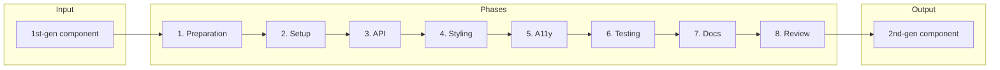

---
# Washing machine migration workflow – structured data for AI parsing
workflow:
  name: "1st-gen to 2nd-gen component migration"
  slug: washing-machine
  audience: [human, ai-agent]
  reference_component: badge
  paths:
    first_gen: "1st-gen/packages/<component>/"
    core: "2nd-gen/packages/core/components/<component>/"
    swc: "2nd-gen/packages/swc/components/<component>/"
  phases:
    - preparation
    - setup
    - api-migration
    - styling
    - accessibility
    - testing
    - documentation
    - review
  style_guides:
    typescript: "Ticket 7"
    css: "Ticket 8"
    testing: "Ticket 10"
  external_links:
    wcag_apg: "https://www.w3.org/WAI/ARIA/apg/patterns/"
  contributor_docs:
    workstream: "CONTRIBUTOR-DOCS/03_project-planning/02_workstreams/02_2nd-gen-component-migration/"
    status: "CONTRIBUTOR-DOCS/03_project-planning/02_workstreams/02_2nd-gen-component-migration/01_status.md"
    analyze: "CONTRIBUTOR-DOCS/03_project-planning/02_workstreams/02_2nd-gen-component-migration/02_step-by-step/01_analyze-rendering-and-styling/"
    component_analysis_output: "CONTRIBUTOR-DOCS/03_project-planning/03_components/<component>/rendering-and-styling-migration-analysis.md"
---

<!-- Generated breadcrumbs - DO NOT EDIT -->

[CONTRIBUTOR-DOCS](../../../README.md) / [Project planning](../../README.md) / [Workstreams](../README.md) / [2nd-gen Component Migration](../README.md) / Washing machine workflow

<!-- Document title (editable) -->

# Washing machine: 1st-gen to 2nd-gen migration guide

<!-- Document content (editable) -->

This guide walks you through migrating a Spectrum Web Component from **1st-gen** to **2nd-gen**. Think of it as a washing machine: you put 1st-gen code in and get clean 2nd-gen code out, with better structure and quality along the way. (This is the **migration workflow** for this workstream.)

---

## Quick Migration Checklist

**Before starting a migration:**

- [ ] Component analysis exists
- [ ] Breaking changes documented
- [ ] Core folder created
- [ ] SWC folder created

**Migration steps:**

- [ ] Move base class to core
- [ ] Create SWC component
- [ ] Migrate public API
- [ ] Migrate CSS (and run stylelint—property order, no-descending-specificity, tokens; see Phase 4)
- [ ] Implement accessibility
- [ ] Add tests (test stories + a11y spec; see Phase 6)
- [ ] Add stories
- [ ] Open PR

---

## Relationship to this workstream

This workflow is the **single end-to-end guide** for doing a migration (including accessibility, testing, and review). It aligns with the step-by-step docs in this folder:

- **Workstream:** [2nd-gen Component Migration](../README.md) — README, status table, and **7 step-by-step docs** that describe the refactor-first path (factor 1st-gen, move base to core, then add 2nd-gen).
- **Status table:** [01_status.md](../01_status.md) — use it to see which components have completed which steps and to **update progress** when you finish a migration.

**How the 8 phases map to the 7 step-by-step docs:**

| Washing machine phase | Step-by-step doc(s) |
|----------------------|---------------------------|
| **1. Preparation** | Uses output of **Step 1: Analyze rendering and styling** (read the component analysis). Plan breaking changes and scope. |
| **2. Setup** | **Steps 2–3** (factor rendering out of 1st-gen, move base to core) if you follow the refactor path; or create 2nd-gen files from scratch. |
| **3. API migration** | **Step 4: Formalize Spectrum data model** + **Step 5: Add 2nd-gen SWC** (API overrides/additions). |
| **4. Styling** | **Step 6: Migrate rendering & styles from Spectrum CSS**. |
| **5. Accessibility** | (No dedicated step — this guide adds it.) |
| **6. Testing** | (Mentioned in steps as "confirm tests pass" — this guide makes it a full phase.) |
| **7. Documentation** | **Step 7: Add stories for 2nd-gen component** + JSDoc and usage docs. |
| **8. Review** | (No dedicated step — this guide adds checklist and PR.) |

When you're **refactoring an existing 1st-gen component** (base moves to core, then 2nd-gen is added), follow the **Refactor path** below and use the step-by-step docs for the details. When you're **creating a new 2nd-gen component** or working mainly in 2nd-gen, use this guide's phases as the main sequence.

---

## Workflow overview



---

## Refactor path (1st-gen in place)

If you are migrating a **component that already exists in 1st-gen** and the plan is to move its base to core and then add 2nd-gen, do this **before** or as part of **Phase 2 (Setup)**:

1. **Factor rendering out of 1st-gen** — [Step 2](02_factor-rendering-out-of-1st-gen-component.md): Rename to `[Component].base.ts`, create new `[Component].ts` that extends the base, move `render()` and `styles` to the concrete class. Confirm tests still pass.
2. **Move base class to 2nd-gen core** — [Step 3](03_move-base-class-to-2nd-gen-core.md): Create `core/components/<name>/`, move the base and types there, update 1st-gen to import from core. Confirm tests still pass.

After that, continue with **Phase 2** (create 2nd-gen SWC directory and files) and the rest of the washing machine. Steps 4–7 (data model, implement 2nd-gen, render & style, stories) align with Phases 3–4 and 7 below.

---

## Core vs SWC: where does code go?

Before you start, know the split:

| Layer | Location | Contains |
|-------|----------|----------|
| **Core** | `2nd-gen/packages/core/components/<name>/` | Shared logic, **no** rendering. Base class, types, validation, mixins. |
| **SWC** | `2nd-gen/packages/swc/components/<name>/` | Rendering, styling, element registration. Extends core base; adds `render()`, CSS, stories. |

- **Base class (core):** Properties, getters/setters, lifecycle, validation. Use `@internal` for non-public API.
- **Concrete class (SWC):** `extends` the base; adds `styles`, `render()`, and any SWC-only props (e.g. S2-only options).
- **Types:** In core (e.g. `Badge.types.ts`) so both 1st-gen and 2nd-gen can share or extend.

<details>
<summary>**File layout**</summary>

- Core: `Component.base.ts`, `Component.types.ts`, `index.ts`
- SWC: `Component.ts`, `component.css`, `index.ts`, `stories/`, `test/`
</details>

---

## Phase 1: Preparation

**Goal:** Understand the component and plan the migration.

### What to do

1. **Read the component analysis** (if it exists) for your component. Analysis docs live under [03_components/](../../03_components/) in a folder named after the component (e.g. `badge/rendering-and-styling-migration-analysis.md`). This describes required rendering and styling changes for 2nd-gen.
   - **To generate or refresh the analysis:** Use the [Analyze rendering and styling](01_analyze-rendering-and-styling/README.md) step: follow the README and the [Cursor prompt](01_analyze-rendering-and-styling/cursor_prompt.md) to produce or update the markdown file in `03_components/<component-name>/rendering-and-styling-migration-analysis.md`.
2. **Read the 1st-gen code:** main class, CSS, stories, tests. Understand purpose and public API.
3. **Check dependencies:** What does it extend? What mixins or shared modules does it use?
4. **Review usage:** How is it used in apps or docs? What attributes and slots matter?
5. **List existing bug tickets** How severe are they? Will they require breaking changes? Will they need to be fixed in 1st-gen?
6. **List breaking changes:** What will change for consumers (props, attributes, slots, events)?
7. **Write a short migration plan:** One or two paragraphs: scope, risks, and order of work.

**Example (Badge):** For 2nd-gen Badge you would read `1st-gen/packages/badge/src/Badge.ts`, `src/spectrum-badge.css.ts`, `stories/badge.stories.ts`, and `test/badge.test.ts`; then `2nd-gen/packages/core/components/badge/` and `2nd-gen/packages/swc/components/badge/` to see the target structure.

### What to check

- [ ] I know the full public API (attributes, properties, slots, events).
- [ ] I know all the bugs that exist for this component in JIRA and am familiar with their severity and potential for breaking changes.
- [ ] I know which parts are S1-only vs S2-only (if both exist).
- [ ] I have a list of files to create in core and SWC.

### Common problems and solutions

| Problem | Solution |
|--------|----------|
| No component analysis doc | Use Badge as reference; run the Analyze step Cursor prompt to generate one, or compare 1st-gen vs 2nd-gen structure. |
| Existing 1st-gen bugs | Consider severity, whether fixes require breaking changes, etc. Before deciding how to proceed. |

| Many variants or modes | Plan decision tree: one component vs several (see Decision trees below). |

<details>
<summary>**Stop and ask:** Should this be one component or several?</summary>

Use the decision tree under **Decision trees** below. If the answer is "split," agree with the team on the new component names and APIs before Phase 2.
</details>

### Quality gate

- [ ] Migration plan is written and covers: API surface, breaking changes, and file layout (core vs SWC).

---

## Phase 2: Setup

**Goal:** Create the 2nd-gen file and folder structure (or finish the refactor path: base in core, 2nd-gen SWC created).

### What to do

1. **Core package:** Create `2nd-gen/packages/core/components/<name>/`.
2. **Core files:** `Component.base.ts`, `Component.types.ts`, `index.ts` (export base + types). If you followed the refactor path, the base may already be in core from Step 3.
3. **SWC package:** Create `2nd-gen/packages/swc/components/<name>/`.
4. **SWC files:** `Component.ts`, `component.css`, `index.ts`.
5. **Tests:** `test/component.test.ts` (test stories with play functions), `test/component.a11y.spec.ts` (Playwright ARIA snapshots). Can be stubs at first; see **Phase 6: Testing** for the full structure (Link, Badge, Divider, Asset).
6. **Stories:** `stories/component.stories.ts`.
7. **Wire up package exports** in the right `index`/`package.json` so the new component is importable.

**Example (Badge) — directory layout:**

```
2nd-gen/packages/core/components/badge/
  Badge.base.ts
  Badge.types.ts
  index.ts

2nd-gen/packages/swc/components/badge/
  Badge.ts
  badge.css
  index.ts
  stories/badge.stories.ts
  test/badge.test.ts
  test/badge.a11y.spec.ts
```

**Example (Badge) — SWC class extends base and adds styles:**

```ts
// 2nd-gen/packages/swc/components/badge/Badge.ts
import { BadgeBase } from '@spectrum-web-components/core/components/badge';
import styles from './badge.css';

export class Badge extends BadgeBase {
  public static override get styles(): CSSResultArray {
    return [styles];
  }

  protected override render(): TemplateResult {
    return html`...`;
  }
}
```

### What to check

- [ ] Core base class extends the right mixins (e.g. `SizedMixin`, `SpectrumElement`).
- [ ] SWC class extends the core base (e.g. `extends BadgeBase`).
- [ ] Imports resolve; build passes with minimal or stub implementation.

### Common problems and solutions

| Problem | Solution |
|--------|----------|
| Wrong base or mixin | Copy from Badge: `Badge.base.ts` extends `SizedMixin(ObserveSlotText(ObserveSlotPresence(SpectrumElement, ...)))`. |
| CSS not applied | In SWC class, add `static override get styles(): CSSResultArray { return [styles]; }` and import the CSS module. |
| Package not exporting | Add the component to the package's public exports (e.g. `@adobe/spectrum-wc/badge`). |

### Quality gate

- [ ] All files exist; `nx build` (or equivalent) for the affected packages succeeds; component is importable in Storybook.

---

## Phase 3: API migration

**Goal:** Move properties, methods, and types from 1st-gen to 2nd-gen; keep a clear public API. Align with [Step 4: Formalize Spectrum data model](04_formalize-spectrum-data-model.md) and [Step 5: Add 2nd-gen SWC component](05_implement-2nd-gen-component.md).

### What to do

1. **List the public API:** Attributes, properties, slots, events from 1st-gen.
2. **Define types** in `Component.types.ts` (enums, unions, const arrays). See Badge: `BadgeVariant`, `FIXED_VALUES`, `VARIANTS_*`.
3. **Put shared API in the base (core):** Properties and getters/setters that apply to both S1 and S2. Use `@property({ reflect: true })` where needed. Use section headers: API TO OVERRIDE, SHARED API, IMPLEMENTATION.
4. **Put SWC-only API in the concrete class:** e.g. S2-only props like `outline` on Badge; override `variant` with a narrower type if needed. Use API OVERRIDES and API ADDITIONS sections.
5. **Mark internal API:** Use JSDoc `@internal` for anything not for component consumers.
6. **Implement getter/setter** where you need side effects (e.g. syncing attributes). Prefer simple `@property` when possible.
7. **Add JSDoc** for all public props and slots; include `@element`, `@slot`, `@attribute` where relevant.

### Property migration scenarios

Use this table to decide where each property goes and what to do when the API changes between 1st-gen and 2nd-gen:

| Scenario | Where it goes | Action |
|----------|---------------|--------|
| **Same in S1 and S2** | Base (core) | Move as-is. |
| **Renamed in S2** | Base (core) + deprecation in 1st-gen | Map old → new; in 1st-gen, forward the old attribute to the new prop and emit a deprecation warning if desired. |
| **Removed in S2** | 1st-gen only | Do not migrate; mark as `@deprecated` in 1st-gen and document the removal. |
| **New in S2** | SWC (temporary) | Add in the SWC concrete class; add `@todo` to move to base once 1st-gen is no longer maintained. |

<details>
<summary>**API cleanup during migration**</summary>

When cleaning up the API, consider aligning with Figma option names, [React Spectrum](https://react-spectrum.adobe.com/) naming where it exists, and consistent event prefixes. See TypeScript conventions (Ticket 7) for coding standards; agree with the team on any naming or breaking changes before implementing.
</details>

### Static readonly and validation

- **Static readonly (e.g. `VARIANTS`, `VALID_SIZES`, `FIXED_VALUES`):** In the base class, declare these as abstract-like statics that the SWC subclass must override with the correct set for that generation. They are used for runtime validation, Storybook `argTypes` options, and tests. See Badge: `Badge.VARIANTS`, `Badge.VALID_SIZES`.
- **Debug warnings:** Override `update()` in the base (or SWC) and call `window.__swc.warn()` for invalid property combinations (e.g. invalid variant, or `outline` with a non-semantic variant). Every 2nd-gen component should implement this so invalid states are caught in development.

### Example (Badge) — types in core `Badge.types.ts`

```ts
export const FIXED_VALUES = ['block-start', 'block-end', 'inline-start', 'inline-end'] as const;
export const BADGE_VARIANTS_SEMANTIC = ['accent', 'informative', 'neutral', 'positive', 'notice', 'negative'] as const;
export const BADGE_VARIANTS_S2 = [...BADGE_VARIANTS_SEMANTIC, ...BADGE_VARIANTS_COLOR_S2] as const;

export type FixedValues = (typeof FIXED_VALUES)[number];
export type BadgeVariantS2 = (typeof BADGE_VARIANTS_S2)[number];
export type BadgeVariant = BadgeVariantS1 | BadgeVariantS2;
```

**Example (Badge) — base (core) declares property with union type; SWC overrides with narrower type and required statics:**

```ts
// Core: Badge.base.ts
@property({ type: String, reflect: true })
public variant: BadgeVariant = 'informative';

// SWC: Badge.ts — API OVERRIDES + API ADDITIONS (subclass must override VARIANTS, etc., for validation/Storybook/tests)
static override readonly VARIANTS = BADGE_VARIANTS_S2;

@property({ type: String, reflect: true })
public override variant: BadgeVariant = 'informative';

@property({ type: Boolean, reflect: true })
public subtle: boolean = false;

@property({ type: Boolean, reflect: true })
public outline: boolean = false;
```

### What to check

- [ ] All public 1st-gen props have a 2nd-gen home (base or SWC).
- [ ] Types are in core and reused in SWC.
- [ ] Internal helpers are marked `@internal`.

### Common problems and solutions

| Problem | Solution |
|--------|----------|
| S1 vs S2 different options | Define S1 and S2 const arrays and types in `Component.types.ts`; base uses a union; SWC overrides with the correct set (see Badge `VARIANTS`, `VARIANTS_COLOR`). |
| Complex getter/setter | Only use when you need attribute sync or validation; otherwise use `@property`. |
| Deprecated 1st-gen exports | In 1st-gen, re-export from core and mark `@deprecated`; do not duplicate logic. |
| Component wraps native `<input>` (e.g. checkbox) | **Base:** Define an abstract getter for the input element (e.g. `abstract get inputElement(): HTMLInputElement`). Implement `handleChange()` that reads from the input, updates state (e.g. `checked`), dispatches a cancelable `change` event, and reverts state if `event.defaultPrevented`. **SWC:** Use `@query('#input')` to provide the input element; call `this.handleChange()` from the input's `@change` handler. Optionally set `static shadowRootOptions = { delegatesFocus: true }` so host focus delegates to the input. See `Checkbox.base.ts` and `Checkbox.ts`. |

<details>
<summary>**Stop and ask:** Breaking API changes</summary>

If you are renaming or removing a public prop or attribute, confirm with the team and plan deprecation or a migration path for consumers.
</details>

### Quality gate

- [ ] Public API is documented; types are in core; base holds shared logic; SWC holds rendering and S2-only API.

---

## Phase 4: Styling

**Goal:** Migrate CSS to 2nd-gen structure and follow the CSS style guide. Follow the [full migration steps](CONTRIBUTOR-DOCS/02_style-guide/01_css/04_spectrum-swc-migration.md); see also [Step 6: Migrate rendering & styles from Spectrum CSS](06_migrate-rendering-and-styles.md) for workstream context.

### What to do

1. **Use the CSS migration guide:** Follow [Step 6: Migrate rendering & styles from Spectrum CSS](06_migrate-rendering-and-styles.md) and the [full migration steps](CONTRIBUTOR-DOCS/02_style-guide/01_css/04_spectrum-swc-migration.md). For token and design reference while implementing, add the Figma file from the token/component specs to your Cursor context or component folder so token names and options stay aligned with Spectrum 2.
2. **Use [03_components/](../../03_components/) for spectrum-two alignment:** The component analysis (e.g. `03_components/checkbox/rendering-and-styling-migration-analysis.md`) documents DOM structure, modifiers, and CSS→SWC mapping from the **spectrum-css spectrum-two** branch. Use it together with the spectrum-css `spectrum-two` component and theme files to ensure 2nd-gen uses the same token names and patterns (e.g. `--spectrum-*` theme variables, checkmark/dash icon size tokens). When the analysis lists spectrum-two class names or modifiers, match those to the corresponding tokens in spectrum-css (e.g. `Checkmark75`/`Dash75` → `checkmark-icon-size-75` / `dash-icon-size-75`).
3. **Copy and adapt S2 styles** into the SWC `[component-name].css`. Prefer the 2nd-gen style guide (Ticket 8). Source S2 styles from the `spectrum-css` repo, `spectrum-two` branch, component `index.css` (do not use `dist` styles—2nd-gen applies different pre-processing).
4. **Use design tokens:** Replace hard-coded values with `token(...)` (e.g. `token("border-width-200")`). Where the theme exposes `--spectrum-*` variables (e.g. `--spectrum-corner-radius-small-size-medium`), reference them with a fallback so 2nd-gen participates in theme theming: `var(--spectrum-corner-radius-small-size-medium, token("corner-radius-small-size-medium"))`.
5. **Follow component CSS guidelines** for [stylesheet organization, selectors, and variant management](CONTRIBUTOR-DOCS/02_style-guide/01_css/01_component-css.md) and managing the customization API through [custom properties](CONTRIBUTOR-DOCS/02_style-guide/01_css/02_custom-properties.md).
6. **Keep specificity low:** Prefer class-based selectors; avoid deep or brittle selectors.
7. **Add forced-colors support** where needed for high contrast.
8. **Handle sizing** via size classes or CSS custom properties, consistent with other 2nd-gen components.
9. **Run and fix 2nd-gen CSS linting (stylelint):** After writing or updating `2nd-gen/packages/swc/components/<component>/<component>.css`, run the project stylelint (e.g. `nx run swc:lint` or the repo’s CSS lint script) and fix all reported errors. The 2nd-gen stylelint config applies to `2nd-gen/**/*.css` and enforces:
   - **Property order** (`order/properties-order`): Declarations must follow the project’s logical order (display/position/flex/box model/font/color/backgrounds/overflow/pointer-events/content/opacity/transition, etc.). See `linters/stylelint-property-order.js`.
   - **No descending specificity** (`no-descending-specificity`): Selectors with lower specificity must appear before selectors with higher specificity that could match the same element (e.g. `:host([disabled])` before `:host([checked][disabled])`).
   - **Declaration empty line** (`declaration-empty-line-before`): Add an empty line before declarations when required by the config (e.g. between property groups).
   - **Token usage** (2nd-gen override): For `2nd-gen/**/*.css`, `scale-unlimited/declaration-strict-value` requires design tokens (e.g. `token("...")` or CSS custom properties) for color, font-size, and related properties instead of hard-coded values.

   Fixing these as part of Phase 4 keeps the CSS consistent and avoids lint failures at review time.

For detailed examples (tokens, custom properties, variant classes, `render()` with `classMap()`), see the [full migration steps](CONTRIBUTOR-DOCS/02_style-guide/01_css/04_spectrum-swc-migration.md) and [component CSS guidelines](CONTRIBUTOR-DOCS/02_style-guide/01_css/01_component-css.md).

**Template and render review:** Implement `render()` (e.g. from spectrum-css `stories/template.js` or from 1st-gen), then confirm in Storybook that the component renders correctly. Keep the **original slot structure** from 1st-gen unless the component analysis or Spectrum 2 design requires a change. Prefer **modern HTML** where it improves semantics or accessibility (e.g. native form controls, `<button>`, `<input type="checkbox">`). See [Step 6](06_migrate-rendering-and-styles.md) for using the spectrum-css template as a starting point.

**Icons:** If the component needs an icon (e.g. checkmark, dash) and 2nd-gen has no icon package, use **inline SVG** in the template or iconography via CSS (e.g. `::before` with a background or inline SVG in the component). See `2nd-gen/packages/swc/components/checkbox/Checkbox.ts` for inline SVG checkmark and dash.

### What to check

- [ ] No inline styles for theme/size; use CSS and classes.
- [ ] Tokens and custom properties align with Spectrum 2.
- [ ] Follows the [full migration steps](CONTRIBUTOR-DOCS/02_style-guide/01_css/04_spectrum-swc-migration.md).
- [ ] Adheres to the [component styling guidelines](CONTRIBUTOR-DOCS/02_style-guide/01_css/01_component-css.md).
- [ ] **2nd-gen CSS passes stylelint:** No `order/properties-order`, `no-descending-specificity`, `declaration-empty-line-before`, or token-usage errors in the component’s `.css` file (run `nx run swc:lint` or the repo’s lint command).

### Common problems and solutions

For troubleshooting and detailed patterns (e.g. 1st-gen Constructable Stylesheets vs plain `.css`, variant classes, size/density), see the [full migration steps](CONTRIBUTOR-DOCS/02_style-guide/01_css/04_spectrum-swc-migration.md) and [component styling guidelines](CONTRIBUTOR-DOCS/02_style-guide/01_css/01_component-css.md).

| Problem | Solution |
|--------|----------|
| `order/properties-order` errors | Reorder declarations to match `linters/stylelint-property-order.js` (e.g. display → position → flex → box sizing → margin → font → overflow → pointer-events → content → opacity → transition). |
| `no-descending-specificity` errors | Place lower-specificity selectors before higher-specificity ones (e.g. `:host([disabled])` before `:host([checked][disabled])`; single-attribute or single-pseudo before compound selectors). Split rule blocks if needed so order is consistent. |
| Token / `declaration-strict-value` | Replace hard-coded colors, font-size, etc. with `token("...")` or the theme variable with fallback (e.g. `var(--spectrum-*, token("..."))`). |

### Quality gate

- [ ] Follows the [full migration steps](CONTRIBUTOR-DOCS/02_style-guide/01_css/04_spectrum-swc-migration.md).
- [ ] Adheres to the [component styling guidelines](CONTRIBUTOR-DOCS/02_style-guide/01_css/01_component-css.md).
- [ ] Stylelint passes for the component’s CSS (no 2nd-gen CSS lint errors).

---

## Phase 5: Accessibility

**Goal:** Implement WCAG-aligned behavior and document it. Follow the repo’s [Accessibility testing](https://github.com/adobe/spectrum-web-components/blob/main/CONTRIBUTOR-DOCS/01_contributor-guides/09_accessibility-testing.md) guide and the PR template’s accessibility checklist; for public-facing usage, refer to the [public docs site](https://opensource.adobe.com/spectrum-web-components/) accessibility guidance where applicable.

### What to do

1. **Use semantic HTML when possible** (e.g. `<button>` instead of `<div role="button">`)
2. **Refer to existing patterns as guidance:** Check [WCAG ARIA Authoring Practices Guide (APG)](https://www.w3.org/WAI/ARIA/apg/patterns/) for your component type (e.g. button, listbox, combobox), Heydon Pickering's [Inclusive Components](https://inclusive-components.design/), Deque Univiersity's [Code Library (Beta)](https://dequeuniversity.com/library/). and other component libraries with existing components.
3. **Add ARIA attributes as needed:** `role`, `aria-*` as required by the pattern. 

> Prefer semantic HTML where it gives the same behavior. 
> A component's role should be inherent to what it is and what it does, not conditional. For example, a component should not be a `menu` or a `listbox`; we should have two separate components, one menu and one listbox.
> Be aware the IDREFs, such as `aria-labelledby` or `active-descendant` [cannot cross roots](https://alice.pages.igalia.com/blog/how-shadow-dom-and-accessibility-are-in-conflict/).

5. **Keyboard support:** All actions available via keyboard; focus order and focus management match the pattern, paying attention to complex component navigation and disabled components. (See WAI ARIA APG's (Developing a Keyboard Interface)[https://www.w3.org/WAI/ARIA/apg/practices/keyboard-interface/].)
6. **Focus management:** For overlays or popups, trap/restore focus as in the APG.
7. **Screen reader:** Ensure name, state, and value are exposed (e.g. `aria-label`, `aria-expanded`, `aria-selected`).
8. **Test with assistive tech** where possible (screen reader, keyboard-only, screenreader click command).
9. **Document a11y** in JSDoc and in the guide (how to use the component accessibly) ensuring that examples use the component accessbility.

**Example (Badge):** Badge is presentational (no interactive role). It doesn’t need a widget role; the text in the default slot and optional icon slot provide the name. No keyboard behavior is required. For interactive components (e.g. button, combobox), follow the matching APG pattern and add the suggested `role` and `aria-*` attributes.

**Native vs custom controls:** If the component wraps a **native form control** (e.g. `<input type="checkbox">`), semantics and keyboard support come from the native element; set `delegatesFocus: true` on the SWC's `shadowRootOptions` so host focus delegates to the control. If the component is a **custom control** (e.g. radio implemented with a div), set `role` and `aria-*` on the host (or the interactive element) and manage focus and keyboard in the SWC. See Checkbox (native input) and Radio (custom control with `role="radio"`).

### What to check

- [ ] ARIA and semantics match the chosen APG pattern.
- [ ] Component behaves as expected with screen reader. 
- [ ] Keyboard and focus behavior are implemented and tested.
- [ ] No accessibility regressions vs 1st-gen.

### Common problems and solutions

| Problem | Solution |
| Unclear which pattern applies | Start from the component's primary role (e.g. "combobox" → Combobox pattern). Consider splitting into more than one component (e.g. "sp-menu" into menu and listbox components |
| Unclear which pattern applies | Start from the component's primary role (e.g. "combobox" → Combobox pattern). |
| Focus trap in overlays | Use a shared focus-trap utility if the repo provides one; follow APG for modal/dialog. |
| Custom controls | Ensure they have roles, names, and keyboard support; avoid div/span without semantics. |

<details>
<summary>**Stop and ask:** Custom events vs native events</summary>

Prefer native events when they give the right semantics (e.g. `click`). Add custom events only when you need to expose extra data or lifecycle (e.g. `sp-close`). Document both in JSDoc.
</details>

### Quality gate

- [ ] Pattern and example accessible component library examples are identified and linked
- [ ] Keyboard and ARIA are implemented
- [ ] Accessibllity tests added or updated
- [ ] Screenreader testing has been performed
- [ ] APG pattern is identified and linked; keyboard and ARIA are implemented; a11y tests added or updated.

---

## Phase 6: Testing

**Goal:** Automated tests for behavior and accessibility.

### What to do

1. **Unit tests (Vitest):** Defaults, props, slots, key interactions. Use the repo test helpers (e.g. `fixture`). See `2nd-gen/packages/swc/components/badge/test/badge.test.ts`.
2. **A11y tests (Playwright):** Run a11y checks in Storybook or a test page. See `badge.a11y.spec.ts`.
3. **Storybook play functions:** Add play functions where they help (e.g. open state, keyboard). Use for visual and a11y coverage.
4. **Coverage:** Test main props, variants, and user actions; aim for good coverage of the public API.

**Test stories and a11y spec structure**

Use the same two-file layout as other migrated components so behavior and accessibility are covered in a consistent way:

| File | Purpose |
|------|--------|
| `test/<component>.test.ts` | **Test stories** — Dev-only Storybook stories (under *Component/Tests*) that reuse the main stories and add `play` functions to assert defaults, props, slots, and mutations. Use `getComponent` / `getComponents` from `utils/test-utils.js` and `expect` / `step` from `@storybook/test`. Spread the main `meta`, set `title: 'Component/Tests'`, `docs: { disable: true }`, and `tags: ['!autodocs', 'dev']`. |
| `test/<component>.a11y.spec.ts` | **A11y spec** — Playwright tests that load Storybook stories via `gotoStory` (from `utils/a11y-helpers.js`) and assert the accessibility tree with `toMatchAriaSnapshot`. Story IDs follow the pattern `components-<name>--<story-name>` (e.g. `components-link--overview`). Story names are kebab-case (e.g. `GroupExample` → `group-example`). |

**Reference implementations:** `link/test/`, `checkbox/test/`, `radio/test/`, `badge/test/`, `divider/test/`, and `asset/test/` in `2nd-gen/packages/swc/components/` show the full pattern: test stories that spread main story exports and add `play` assertions, plus an a11y spec that covers overview, variants, and accessibility stories.

**Example (Badge) — Storybook test story with play function:**

```ts
// test/badge.test.ts — dev story with play to assert defaults
export const OverviewTest: Story = {
  ...Overview,
  play: async ({ canvasElement, step }) => {
    const badge = await getComponent<Badge>(canvasElement, 'swc-badge');
    await step('renders expected default values and slot content', async () => {
      expect(badge.variant).toBe('informative');
      expect(badge.size).toBe('m');
      expect(badge.textContent?.trim()).toBeTruthy();
    });
  },
};
```

### What to check

- [ ] `test/<component>.test.ts` and `test/<component>.a11y.spec.ts` are present and follow the structure described above (test stories under *Component/Tests*, a11y spec with `gotoStory` and `toMatchAriaSnapshot`).
- [ ] Unit tests pass; a11y tests pass.
- [ ] Critical paths (render, props, slots, events) are covered.
- [ ] Tests follow the project testing conventions (Ticket 10).

### Common problems and solutions

| Problem | Solution |
|--------|----------|
| Async timing | Use `await nextFrame()` or `element.updateComplete` as needed. |
| Shadow DOM | Use `shadowRoot.querySelector` and the test utils the repo provides. |
| A11y rules too strict | Tune rules in the a11y config if needed; do not disable without team agreement. |

### Quality gate

- [ ] All new tests pass; no unnecessary skipped tests; testing style guide followed.

---

## Phase 7: Documentation

**Goal:** JSDoc, Storybook stories, and usage docs so others can use and migrate. Align with [Step 7: Add stories for 2nd-gen component](07_add-stories-for-2nd-gen-component.md).

### What to do

1. **JSDoc:** Every public prop, slot, event, and the element itself. Include `@example` where it helps. Use `@internal` for non-public API.
2. **Storybook stories:** Follow the **autodocs/story template** used in 2nd-gen Badge, Divider, and similar components: `getStorybookHelpers`, METADATA (args, argTypes, meta), default story plus stories for variants, sizes, and key states. Add section headers: METADATA, STORIES, HELPER FUNCTIONS (if needed). Use `tags: ['!dev']` on non-default stories. Reference `2nd-gen/packages/swc/components/badge/stories/badge.stories.ts` and `2nd-gen/packages/swc/components/divider/stories/divider.stories.ts` for structure.
3. **Wire size and variant controls (if applicable):** For components with **size** or other variant attributes (e.g. `size`, `variant`, `static-color`), ensure Storybook controls actually drive the component so changing the control updates the canvas.
   - **Storybook args and argTypes:** (a) set a default in meta `args` (e.g. `args: { ...args, size: 'm' }`) so the control has an initial value; (b) configure `argTypes` for the attribute with `control: { type: 'select' }`, `options` from the component (e.g. `Component.VALID_SIZES`), and optionally `table: { defaultValue: { summary: 'm' } }` for the docs table; (c) include the attribute in the Playground story `args` so the control is visible and applies.
   - **Custom Elements Manifest (CEM) and mixin attributes:** The Storybook helpers apply only attributes that appear in the component’s Custom Elements Manifest. If the attribute comes from a **mixin** on the base class (e.g. `size` from `SizedMixin`), the CEM analyzer may not merge it into the SWC element’s manifest, so the template never sets it and the control has no effect. **Fix:** Declare the property explicitly on the **SWC component class** (e.g. in `Radio.ts`) with `@property({ type: String, reflect: true }) public override size: ElementSize = 'm';` so the CEM includes it and the attribute is reflected for CSS (e.g. `:host([size="s"])`). Then run **`yarn analyze`** in the SWC package to regenerate `.storybook/custom-elements.json` before verifying that Storybook controls drive the component. See `Radio.ts`, `Checkbox.ts`, and their stories for the full pattern.
4. **Review stories:** Confirm in Storybook that every variant, size, and important state has a story; control labels and argTypes are correct; **size and variant controls change the component when adjusted**; and the component renders as expected.
5. **Usage docs:** Short "how to use" in the guide or in Storybook docs; link to Spectrum design spec if available.
6. **Migration notes:** If the API changed from 1st-gen, document the mapping (old prop → new prop, or breaking change).

**Example (Badge) — JSDoc with `@element` and `@example`:**

```ts
/**
 * A badge component that displays short, descriptive information about an element.
 *
 * @element swc-badge
 *
 * @example
 * <swc-badge variant="positive">New</swc-badge>
 *
 * @example
 * <swc-badge variant="neutral" fixed="fill">
 *   <sp-icon-checkmark slot="icon"></sp-icon-checkmark>
 *   Verified
 * </swc-badge>
 */
export class Badge extends BadgeBase { ... }
```

**Example (Badge) — Storybook meta and default story:**

```ts
// METADATA
const { args, argTypes, template } = getStorybookHelpers('swc-badge');
argTypes.variant = { control: { type: 'select' }, options: Badge.VARIANTS };
argTypes.size = { control: { type: 'select' }, options: Badge.VALID_SIZES };

export const meta: Meta = {
  title: 'Badge',
  component: 'swc-badge',
  args,
  argTypes,
  render: (args) => template(args),
};

// STORIES — default
export const Overview: Story = {
  args: { size: 'm', variant: 'informative', 'default-slot': 'Active' },
};
```

### What to check

- [ ] All public API has JSDoc; Storybook shows the main use cases.
- [ ] For components with size/variant: controls change the component in the canvas; if the attribute comes from a mixin, the SWC class declares it (and CEM was regenerated with `yarn analyze`) so the template applies it.
- [ ] Migration notes exist when the API is not a direct port.

### Common problems and solutions

| Problem | Solution |
|--------|----------|
| Too many story variants | Use `argTypes.options` from the component (e.g. `Badge.VARIANTS`); one story can cover many variants. |
| Missing examples | Add at least one `@example` in JSDoc and one default Storybook story. |
| Size or variant control doesn't change the component | The Storybook template only applies attributes that are in the Custom Elements Manifest. If the attribute comes from a mixin on the base (e.g. `SizedMixin`), the CEM may not list it for the SWC element. Declare the property on the SWC class with `@property({ reflect: true })` so the CEM includes it, then run `yarn analyze` to regenerate the manifest. See Radio (SWC) for an example. |

### Quality gate

- [ ] JSDoc complete for public API; Storybook stories and usage docs in place; migration notes added if needed.

---

## Phase 8: Review

**Goal:** Final checks and PR readiness. Update the workstream **status table** so the team can see progress.

### What to do

1. **Run the full checklist** (copy below).
2. **Lint:** Run the project linter and fix any errors in the touched files (e.g. `nx run swc:lint` or the repo’s standard lint command). For 2nd-gen component CSS, this runs **stylelint** on `2nd-gen/**/*.css` and enforces property order, no-descending-specificity, declaration empty lines, and token usage—ensure these are fixed in Phase 4 (Styling) and re-check here (see [Phase 4: 2nd-gen CSS linting](#phase-4-styling)).
3. **Tests:** Run the full test suite for the affected packages.
4. **Build:** Ensure build succeeds.
5. **Storybook:** Load the component in Storybook; click through stories and variants.
6. **Update status:** In the [status table](../01_status.md), mark the component's row with checkmarks for the steps you completed (Analyze, Factor, Move to Core, Data Model, Add 2nd-Gen, Render & Style, Add Stories).
7. **Create the PR** with a clear description: component name, breaking changes, and link to this guide or the ticket.

### Final checklist (copy and use)

- [ ] Phase 1: Migration plan done; API and breaking changes understood.
- [ ] Phase 2: All files created; build passes; component importable.
- [ ] Phase 3: API in base/SWC; types in core; JSDoc and @internal set.
- [ ] Phase 4: CSS follows style guide; tokens and variants work; **stylelint passes** for 2nd-gen component CSS (property order, no-descending-specificity, tokens).
- [ ] Phase 5: WCAG pattern applied; keyboard and ARIA done; a11y tests pass.
- [ ] Phase 6: Unit and a11y tests pass; coverage is reasonable.
- [ ] Phase 7: JSDoc and stories complete; migration notes if needed.
- [ ] Phase 8: Lint clean; tests green; Storybook verified; status table updated; PR created.

### Quality gate

- [ ] Checklist complete; status table updated; PR open; at least one reviewer assigned.

---

## Decision trees

Use these when you are not sure how to structure the migration.

### Should this component be split into multiple components?

- Does it have **two or more distinct patterns** in one (e.g. "button" vs "link" that share markup but different behavior)?  
  → **Consider splitting** (e.g. base + Button + Link).
- Is it **one clear concept** with variants (e.g. Badge with sizes and colors)?  
  → **Keep as one component** with variant props.
- **Stop and ask** if the team has already decided (e.g. from component analysis).

### Should this component be combined with another?

- Are two 1st-gen components **always used together** or **almost the same API**?  
  → Consider one 2nd-gen component with a prop (e.g. "mode") or a single unified API.
- Are they **separate in Spectrum design** and used in different contexts?  
  → Keep separate.

### What shared utilities can be extracted?

- Is the same logic used in **multiple 2nd-gen components** (e.g. focus trap, keyboard nav)?  
  → Put it in core or a shared module.
- Is it **only for this component**?  
  → Keep it in the component (base or SWC as appropriate).

### How should variants be implemented?

- **Small, fixed set** (e.g. size: S/M/L): Use a **string attribute** and reflect it; use a const array for type and Storybook options.
- Match the **primary role** of the component (button, listbox, combobox, dialog, etc.) to native HTML or an existing accessible [pattern](https://www.w3.org/WAI/ARIA/apg/patterns/).
- **Boolean toggles** (e.g. disabled, readonly): Use **boolean attributes** and reflect.
- **Stop and ask** when the 1st-gen uses a different pattern (e.g. only classes) and you want to change to attributes.

### What accessibility pattern applies?

- Match the **primary role** of the component (button, listbox, combobox, dialog, etc.) to native HTML or an existing accessible [pattern](https://www.w3.org/WAI/ARIA/apg/patterns/).
- If it composes several roles (e.g. combobox + listbox), follow the **composite** pattern and its keyboard and ARIA requirements.

---

## Reference: Badge migration

Use Badge as the reference implementation:

| Area | 1st-gen | 2nd-gen core | 2nd-gen SWC |
|------|---------|--------------|-------------|
| **Base class** | — | `Badge.base.ts` (logic, mixins, shared props) | — |
| **Concrete class** | `src/Badge.ts` | — | `Badge.ts` (extends BadgeBase, render, styles) |
| **Types** | Inline / re-export | `Badge.types.ts` (VARIANTS_*, FixedValues, BadgeVariant) | Imports from core |
| **CSS** | `badge.css.ts` (Constructable) | — | `badge.css` (plain CSS module) |
| **Stories** | `stories/badge.stories.ts` | — | `stories/badge.stories.ts` (getStorybookHelpers, argTypes from component) |
| **Tests** | `test/badge.test.ts`, `badge.a11y.spec.ts` | — | `test/badge.test.ts`, `test/badge.a11y.spec.ts` |

**Paths:**

- 1st-gen: `1st-gen/packages/badge/`
- 2nd-gen core: `2nd-gen/packages/core/components/badge/`
- 2nd-gen SWC: `2nd-gen/packages/swc/components/badge/`

**Other reference components (by concern):**

- **Link** — Variant and static-color attributes; test stories and a11y spec structure.
- **Radio** — Size from `SizedMixin`: declare `size` on SWC for CEM; custom control with `role="radio"`, no native input.
- **Checkbox** — Native `<input type="checkbox">`: base with abstract `inputElement`, `handleChange` with revert on preventDefault; SWC with `delegatesFocus`, inline SVG for checkmark/dash; size from mixin (declare on SWC); indeterminate state.

---

## Style guides and resources

- **TypeScript:** Conventions (Ticket 7)
- **CSS:** Conventions (Ticket 8)
- **Testing:** Conventions (Ticket 10)
- **WCAG APG:** [https://www.w3.org/WAI/ARIA/apg/patterns/](https://www.w3.org/WAI/ARIA/apg/patterns/)
- **Component analysis:** [03_components/](../../03_components/)
- **2nd-gen guides (Storybook):** `2nd-gen/packages/swc/.storybook/guides/`
