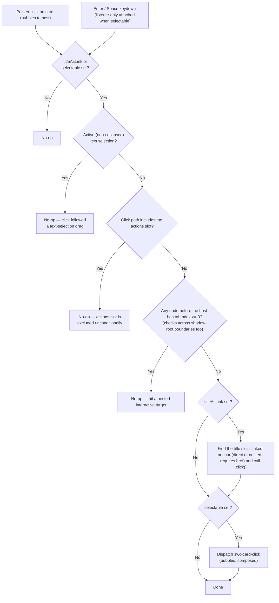

<!-- Generated breadcrumbs - DO NOT EDIT -->

[CONTRIBUTOR-DOCS](../../../README.md) / [Project planning](../../README.md) / [Components](../README.md) / Card / Card family plan

<!-- Document title (editable) -->

# Card family plan

<!-- Generated TOC - DO NOT EDIT -->

<strong>In this doc</strong>

- [TL;DR](#tldr)
- [Table of contents](#table-of-contents)
- [Reference implementations](#reference-implementations)
    - [React (primary behavior/API reference)](#react-primary-behaviorapi-reference)
    - [1st-gen `sp-card` (secondary reference)](#1st-gen-sp-card-secondary-reference)
- [Scope and component boundaries](#scope-and-component-boundaries)
- [Architecture: core vs SWC split](#architecture-core-vs-swc-split)
- [2nd-gen API decisions](#2nd-gen-api-decisions)
    - [Shared properties (already on `CardBase`)](#shared-properties-already-on-cardbase)
    - [Variant support per component](#variant-support-per-component)
    - [Slots and layout per component](#slots-and-layout-per-component)
- [Styling approach](#styling-approach)
- [Accessibility decisions](#accessibility-decisions)
    - [A11y-1: Labeling guidance for preview and glyph content](#a11y-1-labeling-guidance-for-preview-and-glyph-content)
    - [A11y-2: Avatar/thumbnail vs. title relationship](#a11y-2-avatarthumbnail-vs-title-relationship)
    - [A11y-3: Whole-card-clickable while preserving nested interactive targets](#a11y-3-whole-card-clickable-while-preserving-nested-interactive-targets)
- [Deferred / out of scope](#deferred--out-of-scope)
- [Test coverage](#test-coverage)
- [Component checklist](#component-checklist)
    - [Preparation (this doc)](#preparation-this-doc)
    - [Per-component tickets](#per-component-tickets)
- [Blockers and open questions](#blockers-and-open-questions)
- [References](#references)

<!-- Document content (editable) -->

> **SWC-2316** · Planning output for the `swc-card` family, covering the shared template/reusable-styles scaffold (SWC-2316) plus the three per-component follow-ups it unblocks. Not a 1st-gen migration — this is new work modeled primarily on React's existing card implementation, with `sp-card` (1st-gen) consulted only where it affects a future consumer migration guide. Must be reviewed before per-component implementation tickets begin.

## TL;DR

- **Scope:** three concrete components — `swc-card` (regular/collection/gallery), `swc-user-card`, `swc-product-card`. No dedicated `swc-asset-card`; that need is folded into `swc-card` until the 2nd-gen `Asset` component ships.
- **Architecture, already built:** `CardBase` (core, behavior only) + `renderCardTemplate()` (shared SWC render function) + `card-template.css` (shared, implemented). `swc-card` itself now exists (`Card.ts`, `swc-card.ts`, `card.css`, stories) and is mid-implementation; `swc-user-card`/`swc-product-card` have not started.
- **API:** `variant` is a pure style axis, independent of layout (layout is driven entirely by slot presence). `swc-user-card`/`swc-product-card` don't support `quiet`. `title`/`description` are slot-only.
- **Clickable card, no `href` on Card:** the consumer supplies their own link in the `title` slot; `title-as-link` extends its hit area, `selectable` independently makes the card focusable and dispatches a click event. Both are implemented and tested on `CardBase`.
- **Labeling (avatar/thumbnail vs. title) is consumer documentation, not code** — Card doesn't validate or bridge accessible names that consumers already fully control.
- **Styling:** CSS Grid for the shared structural layout; `size`/`density` resolve through `container-padding` tokens for content/footer padding. Region and intra-region spacing (title-to-description, media-to-content) relies on padding plus a blanket `margin-block: 0` reset on slotted content, not a gap-token scale.
- **Gallery layout and the `media` overlay slot are now implemented.** Gallery (triggered by the absence of title/description/actions/footer/default content) renders via `--_swc-card-media-layout`/`--_swc-card-media-contains` custom properties read through `@container style()`. A new `media` slot, opt-in per component via a `renderMedia` callback on `renderCardTemplate()` (mirroring `renderCollection`/`renderGlyph`) and wired up in `swc-card` today, shares `grid-area: media` with `.swc-CardBase-media` — letting consumer-supplied content (badges, avatars) overlay the preview/collection region. This resolves the previously-open Q2 (see [Blockers](#blockers-and-open-questions)) with a dedicated slot rather than `actions`-slot reuse.
- **Tested:** `swc-card` has 29 passing play-function tests (`test/card.test.ts`) plus a 7-test Playwright a11y spec (`test/card.a11y.spec.ts`), covering the shared `CardBase` behavior, the swc-card-specific slot wiring (collection/media), the swc-card CSS layout contracts (gallery trigger, collection overflow, xs merged layout), and the two title-as-link CSS hit-testing mechanisms (stretched link + elevated nested targets, via `elementFromPoint`). The earlier throwaway `CardBase` fixtures (`test-card-base.ts`, `card-base.test.ts`) have been removed now that a real element exists to test through. Chromatic VRT (`test/vrt/`) covers the full visual matrix and all 16 documented custom properties (CEM-coverage-verified).
- **Still open:** four items (see [Blockers](#blockers-and-open-questions)) — naming, deferred design questions, and unresolved product-card scoping, none blocking.

## Table of contents

- [TL;DR](#tldr)
- [Reference implementations](#reference-implementations)
- [Scope and component boundaries](#scope-and-component-boundaries)
- [Architecture: core vs SWC split](#architecture-core-vs-swc-split)
- [2nd-gen API decisions](#2nd-gen-api-decisions)
- [Styling approach](#styling-approach)
- [Accessibility decisions](#accessibility-decisions)
- [Deferred / out of scope](#deferred--out-of-scope)
- [Test coverage](#test-coverage)
- [Component checklist](#component-checklist)
- [Blockers and open questions](#blockers-and-open-questions)
- [References](#references)

## Reference implementations

### React (primary behavior/API reference)

React's card implementation is simplified to four patterns, mixed with consumer-supplied slot content for further variation. Three become dedicated 2nd-gen components; the fourth (`AssetCard`) folds into `swc-card` (see [Scope](#scope-and-component-boundaries)).

| React pattern | Maps to | Notes |
|---|---|---|
| `<Card/>` | `swc-card` | Drives regular, collection, and gallery layouts. Default preview aspect ratio `3/2`. Collection layout uses the `collection` slot (1–3 images, square aspect ratio). Gallery layout omits the content area entirely; styles keyed off that omission force the image to fill the space, and images provide their own aspect ratio (not square by default). Extras like Badge and Avatar are consumer-supplied and positioned via a dedicated `media` overlay slot — a 2nd-gen addition with no React equivalent. |
| `<AssetCard/>` | `swc-card` (folded in) | Reason for differentiation in React is image-vs-illustration handling: image keeps its natural aspect ratio with visible space at the edges; illustration keeps its natural aspect ratio but defaults to 50% of available width with further max-width/height constraints. Preview area uses a square aspect ratio. Treated as a `swc-card` + Asset composition question, not a separate component (see Scope). |
| `<UserCard/>` | `swc-user-card` | Adds an avatar glyph and an optional preview image, aspect ratio `3/1`. |
| `<ProductCard/>` | `swc-product-card` | Expects a logo for the thumbnail glyph; supports an optional preview image, aspect ratio `5/1`; forces `end` alignment for footer content. |

### 1st-gen `sp-card` (secondary reference)

`1st-gen/packages/card` already exists. The differences below are **deliberate redesign decisions**, not migration gaps — this section stays light on purpose and exists only to save a future consumer-migration-guide author from re-deriving this comparison:

- **Variant model split.** 1st-gen's `variant` (`'standard' | 'gallery' | 'quiet'`) conflates layout and style in one enum. 2nd-gen splits these: layout is implicit (driven by which slots are populated — see Scope), and `variant` becomes a pure style axis (`primary` / `secondary` / `tertiary` / `quiet`).
- **Slot consolidation.** 1st-gen uses two image-area slot names (`cover-photo` for standard/quiet, `preview` for gallery). 2nd-gen consolidates to one `preview` slot.
- **Slot-only content model.** 1st-gen's `heading`/`subheading` accept both a plain-text attribute and a slot. 2nd-gen's `title`/`description` are slot-only, per the same convention already established for 2nd-gen components generally.
- **Selection moves to a future container.** 1st-gen's `toggles`/`selected` live on the card itself, with a hover/focus-revealed checkbox. 2nd-gen defers all selection to a future "CardView" grid concept — a deliberate, temporary capability gap versus 1st-gen (see [Deferred](#deferred--out-of-scope)).
- **`asset` attribute precedent.** 1st-gen's `asset` attribute wires `sp-asset` directly into the preview/cover-photo slots. This is the direct precedent behind folding `AssetCard` into `swc-card` now and pointing consumers at the 2nd-gen `Asset` component once it ships, rather than building a dedicated `swc-asset-card`.
- **Whole-card-clickable precedent.** 1st-gen already solves this via a `LikeAnchor` mixin. See [A11y-3](#accessibility-decisions) for how this maps to 2nd-gen.

## Scope and component boundaries

Three concrete SWC components, all extending the already-built `CardBase`:

- **`swc-card`** — regular, collection, and gallery layouts, all driven purely by slot presence, with no explicit layout attribute:
  - **Collection** — populating the `collection` slot displays it; leaving it empty hides it, the same simple presence rule as any other optional slot. Implemented in `card.css`: up to 3 square-aspect images in a row below `preview`, extras beyond the 3rd hidden via `:nth-child(n + 4 of [slot="collection"])`. `preview` and `collection` are independently optional in either direction — a card can render `collection` alone with no `preview`, or vice versa. **`size="xs"` special case:** when both `preview` and `collection` are populated at `xs`, the preview image moves into the first position of the collection row (sharing its square aspect ratio) instead of stacking above it, and only 2 collection images show instead of 3 — implemented via a `--_swc-card-media-layout` custom property read through a CSS `@container style()` query, set conditionally via `:host([size="xs"]):has([slot="preview"]):has([slot="collection"])`.
  - **Gallery** — triggered by the absence of **all** of `title`, `description`, `actions`, the default slot, and `footer`, regardless of whether `preview` or `collection` (or neither) is populated. That combination signals the image/asset is the card's only content, so it fills the available space. Any other combination renders the regular layout. **Implemented** in `card.css`: a `--_swc-card-media-layout: gallery` custom property is set by the qualifying `:host(:not(:has(...)))` selector and read via `@container style(--_swc-card-media-layout: gallery)`; a companion `--_swc-card-media-contains` property (`preview` or `collection`) gates the preview-only aspect-ratio override so it doesn't apply when `collection` already supplies its own square aspect ratio.
  - **Media overlay** — a `media` slot lets consumers layer arbitrary content — a badge, an avatar — over the preview/collection region, most commonly paired with gallery layout. Rendering it is **opt-in per component**: `renderCardTemplate()` takes an optional `renderMedia` callback (default: nothing), the same pattern as `renderCollection`/`renderGlyph`; `swc-card`'s `Card.ts` supplies it, `swc-user-card`/`swc-product-card` will each decide independently once built. Because the callback's output is placed after `.swc-CardBase-media` in the template, normal DOM stacking order paints it on top with no `z-index` needed. The consumer fully owns positioning within that shared area (e.g. `justify-self`/`align-self` plus their own margin, as shown in the `Gallery` story's third variant) — Card exposes no dedicated custom properties for it, consistent with the "flexible overlay" intent. This resolves the previously-open Q2 (gallery badge/avatar via `actions`-slot reuse) with a purpose-built slot instead.
  Phase 1 handles basic `` content and "cover" fit behavior directly. Once the 2nd-gen `Asset` component ships, documentation updates to recommend it in place of plain ``; no dedicated `swc-asset-card` is planned.
- **`swc-user-card`** — adds an `avatar` glyph slot; optional preview image, aspect ratio `3/1`.
- **`swc-product-card`** — adds a `thumbnail` glyph slot (expects a logo); optional preview image, aspect ratio `5/1`; footer content alignment forced to `end`.

Out of scope for all three in this phase: horizontal orientation, hover/selected/disabled/loading states, and checkbox-based selection UI (see [Deferred](#deferred--out-of-scope)).

## Architecture: core vs SWC split

Already implemented (prior scaffold ticket); this plan governs the three concrete-component follow-up tickets built on top of it.

| Layer | Path | Contains |
|---|---|---|
| Core | `2nd-gen/packages/core/components/card/` | `CardBase` — `size` (via `SizedMixin`), `variant`, `density`, and their validation only. No rendering. |
| SWC (shared template) | `2nd-gen/packages/swc/components/card/card-template.ts` | `renderCardTemplate()` — shared anatomy function called from every concrete card's `render()`, following the same shared-function pattern as `renderPendingSpinner()` (`swc/components/button/pending-spinner.ts`). |
| SWC (shared styles) | `2nd-gen/packages/swc/stylesheets/_lit-styles/card-template.css` | Shared structural rules for the `.swc-CardBase`/`.swc-CardBase-*` classes; imported into every concrete card's `styles()` array. |
| SWC (concrete, not started) | `2nd-gen/packages/swc/components/{card,user-card,product-card}/` | Each extends `CardBase` directly — sibling-inheritance pattern, same shape as `ButtonBase` extended independently by `Button` and `ActionButton`. Each owns its own `render()`, styles, glyph slot (if any), stories, and tests. |

## 2nd-gen API decisions

### Shared properties (already on `CardBase`)

| Property | Type | Default | Notes |
|---|---|---|---|
| `size` | `'xs' \| 's' \| 'm' \| 'l' \| 'xl'` | `'m'` | Via `SizedMixin`. |
| `variant` | `CardVariant` | `'primary'` | Static `VARIANTS` is overridable per concrete component (see below) — same mechanism as `ActionButton` overriding `ButtonBase.VALID_SIZES`. |
| `density` | `CardDensity` | `'regular'` | `'compact' \| 'regular' \| 'spacious'`. |
| `titleAsLink` | `boolean` | `false` | Reflects to the `title-as-link` attribute. Extends a consumer-supplied `title`-slot link's hit area to the card surface. See [A11y-3](#a11y-3-whole-card-clickable-while-preserving-nested-interactive-targets). |
| `selectable` | `boolean` | `false` | Manages `tabindex` and dispatches `swc-card-click` on activation (click, Enter, Space), independent of `titleAsLink`. See [A11y-3](#a11y-3-whole-card-clickable-while-preserving-nested-interactive-targets). |

### Variant support per component

Variants are distinct card styles, not fills.

| Component | Supported variants |
|---|---|
| `swc-card` | `primary`, `secondary`, `tertiary`, `quiet` |
| `swc-user-card` | `primary`, `secondary`, `tertiary` (no `quiet`) |
| `swc-product-card` | `primary`, `secondary`, `tertiary` (no `quiet`) |

### Slots and layout per component

Shared (always-rendered) slots from `renderCardTemplate()`: `preview`, `title`, `actions`, `description`, default (body), `footer`. `media` is available to any card via the same function but, like `collection`/glyph, is opt-in per component — see below.

**`media` is a flexible overlay slot, not a layout region.** Rendered only when a concrete component supplies a `renderMedia` callback to `renderCardTemplate()` (default: nothing) — the same opt-in pattern as `renderCollection`/`renderGlyph`. `swc-card`'s `Card.ts` wires it up by passing a `renderMedia` callback that renders the `media` slot; `swc-user-card`/`swc-product-card` will decide independently once built. Unlike `preview`/`collection`, it doesn't occupy its own grid track — `::slotted([slot="media"])` shares `grid-area: media` with `.swc-CardBase-media`, so its content visually overlays the preview/collection region rather than sitting alongside it. That overlay rule lives in the *shared* `card-template.css` (it targets the shared grid area, not per-component markup), while emitting the `<slot>` itself is the per-component's own choice. Stacking is DOM-order-based (the callback's output renders after `.swc-CardBase-media` in the template), needing no `z-index`. The consumer owns positioning within that shared area entirely themselves (`justify-self`, `align-self`, margins) — Card provides the overlay mechanism, not layout opinions about what goes where inside it. See the `swc-card` `Gallery` story's third variant for a worked example (a `swc-badge` and a `swc-avatar`, each independently positioned).

**`actions` slot size propagation:** `CardBase` propagates its own `size` — one step smaller (e.g. a `large` card propagates `medium` to its actions content) — onto elements assigned to the `actions` slot, via `SlotAttributePropagationController`. This mirrors `IllustratedMessageBase`'s use of the same controller for its own `actions` slot, so a slotted `swc-action-button` (or similar) stays visually proportionate to the card without the consumer having to set `size` themselves. Re-propagates reactively when `size` changes, and for content slotted in after the initial render (wired to the slot's `slotchange` in `firstUpdated()`, since the shared `renderCardTemplate()` doesn't take a callback for this).

**`actions` slot support is conditional:** `xs` cards do not support the `actions` slot — there isn't enough room for the shrunk-once-more actions content at that size. `CardBase` exposes this as a `protected get actionsSupported(): boolean` getter (default: `this.size !== 'xs'`), deliberately structured as an overridable getter rather than a hardcoded check so a concrete card can redefine it for its own reasons. `swc-product-card` may need to exclude `actions` entirely, for a different reason than size (still under discussion — see open questions below). `CardBase` cannot visually hide the slot itself, since it has no styling opinions; hiding unsupported actions content is the styling layer's responsibility (`swc-card`'s own CSS, driven by `:host([size="xs"])`). What `CardBase` does provide is a dev-mode-only warning (`checkActionsSupport()`) when actions content is present but `actionsSupported` is false, checked on `size` changes and on `actions` slot changes.

**Default slot presence is observed via `SlotTextController`:** `CardBase` holds a `SlotTextController` (`core/controllers/slot-text-controller`, default slot) and exposes `this.slotHasContent` (a getter delegating to `this.slotText.hasContent`). Each concrete card's `render()` passes `hasDefaultSlotContent: this.slotHasContent` into `renderCardTemplate()`, which applies a `--hasDefault` class to the `.swc-CardBase` wrapper via `classMap` when true — a derived-state class (not a consumer-settable attribute), per the "when to use classes vs attributes" style guide convention.

The controller requires the observed slot to bind its `handleSlotChange` to `slotchange` so content added or removed after the first render is tracked. Because `renderCardTemplate()` is shared, it exposes an `onDefaultSlotChange` option that each concrete card wires to `this.slotText.handleSlotChange`; the template binds it on the default `<slot>`. `DefaultSlotClassUpdatesDynamicallyTest` covers this dynamic add/remove path.

| Component | Glyph slot | Preview aspect ratio | Notes |
|---|---|---|---|
| `swc-card` | none | `3/2` default, `1:1` collection/gallery | **Collection implemented** (`card.css`): 1–3 square-aspect images below `preview`, shown when populated and hidden otherwise (extras past the 3rd hidden via `:nth-child(n + 4 of [slot="collection"])`); `preview` and `collection` are independently optional in either direction, verified via the `WithCollection` story's four combinations (xs preview+3 collection, m preview+3 collection, m preview+2 collection, m collection-only/no-preview). **Gallery implemented** — triggered by the absence of **all** of `title`/`description`/`actions`/default/`footer` — the image becomes the only content and fills the available space; demonstrated in the `Gallery` story (plain preview-only, collection-only, and a `media`-slot badge/avatar overlay variant). |
| `swc-user-card` | `avatar` | `3/1` (optional) | |
| `swc-product-card` | `thumbnail` | `5/1` (optional) | Footer content forced to `end` alignment. |

Only `swc-product-card` and `swc-user-card` include a glyph slot, named `thumbnail` and `avatar` respectively — other card types do not expose one.

## Styling approach

`card-template.css` (implemented; shared across every concrete card) uses **CSS Grid** for the shared structural layout — the `.swc-CardBase` root and its media/content/footer regions are grid areas/tracks. The `media` overlay slot reuses this mechanism rather than adding a new one: it's assigned the same `grid-area: media` as `.swc-CardBase-media`, so overlapping grid-area assignment (not absolute positioning) is what produces the overlay.

`size` and `density` both resolve through token scales:

- **`container-padding-*`** (`2x-small` through `2x-large`) drives the card's own content/footer padding, exposed per size via `--swc-card-base-content-padding-regular/-compact/-spacious`. `density` selects which of the three a given size uses — e.g. for a small card, Compact/Regular/Spacious map to `container-padding-extra-small` / `container-padding-small` / `container-padding-medium` respectively.
- **No `container-gap-*` or `Base/Gap/*` tokens are used.** The original plan called for a gap-token scale to drive spacing both between major regions (media/content/footer) and within a region (e.g. title-to-description). The implemented approach instead relies entirely on padding plus `::slotted(*) { margin-block: 0; }` (a blanket margin reset on slotted content) — there is currently no explicit title-to-description spacing rule.
- **Typography** scales per size via direct `font-size-*`/`line-height-font-size-*` token pairs (e.g. `font-size-100` + `line-height-font-size-100` at `size="s"`), tied to `size`. Font weight is fixed (not size-driven): `title-sans-serif-font-weight` for the title, `regular-font-weight` for description/default-slot/footer content.

## Accessibility decisions

**Where this logic lives:** Card only owns behavior that Card itself is uniquely positioned to provide — its own attribute contracts (A11y-3's `title-as-link`/`selectable`). It does **not** re-validate labeling that a slotted sub-component already owns internally (A11y-1), and it does **not** manage relationships between two slots that the consumer already fully controls themselves (A11y-2). `Avatar` (`Avatar.base.ts`) already has its own `alt`/`decorative` property and a `_warnMissingAlt()` dev-mode check; `Thumbnail` (incoming) and `Asset` (planned) are expected to carry the equivalent contract for their own domains — Card duplicating that validation would be redundant at best, and technically wrong at worst (a raw-``-alt check doesn't even apply to a slotted `<swc-avatar>`). Where Card *does* own behavior, it's validation/behavior only, no rendering, and belongs in `CardBase`'s `SHARED API`/`IMPLEMENTATION` sections — following the `IllustratedMessageBase.handleHeadingSlotChange` precedent (validation lives in the base; concrete classes wire it to their own rendered `<slot>` elements).

### A11y-1: Labeling guidance for preview and glyph content

**Resolution:** documentation only, no `CardBase` runtime validation — matching the `IllustratedMessageBase` precedent for decorative-vs-informative SVGs (documented guidance, not enforced by the component), and consistent with the sub-component ownership described above:

- **`avatar` / `thumbnail` glyph slots:** expected content is the dedicated `Avatar`/`Thumbnail` component (or `Asset`, once available), each of which owns its own labeling contract and dev-mode validation already. Card's docs cross-reference those components' accessibility sections rather than restating alt-text guidance.
- **`preview` slot:** Phase 1 commonly receives a plain `` before `Asset` is available. Guidance (require `alt`, `alt=""` for decorative) lives in Storybook/MDX accessibility prose, not as a runtime check — consistent with how `IllustratedMessageBase` treats its own default-slot SVG.

**Status:** documentation task for each concrete card's accessibility phase; no `CardBase` implementation needed.

### A11y-2: Avatar/thumbnail vs. title relationship

**Resolution:** documentation only, no `CardBase` mechanism — this is consumer-managed, the same as A11y-1. Both the avatar and the title are slotted (light DOM) content the consumer authors directly: they're both children of the host element, just redistributed into different shadow slots for rendering. Because they share the same tree scope (the light DOM, not the card's shadow root), a plain ID-based `aria-labelledby` resolves normally between them with no cross-root complexity — **as long as the `id` lives on the light-DOM title element itself**, e.g. `Jane Doe` + `<swc-avatar slot="avatar" aria-labelledby="jane">`. Since the consumer already owns and writes both elements, there's nothing for Card to bridge or manage.

- **`avatar`** (`swc-user-card`): document the pattern above as the recommended approach when the avatar represents the same person named in the title, to avoid an independent (and likely redundant) label. The trade-off (virtual cursor hearing the name twice in sequence) versus the alternative (the consumer marking their own avatar `decorative`) is a documentation call, not a `CardBase` decision — no sign-off blocking implementation.
- **`thumbnail`** (`swc-product-card`): independent by default, no forced relationship to the title. It typically conveys information the title doesn't (a company logo, a "Premium" designation), so it needs its own author-supplied label. No special handling beyond the general A11y-1 labeling requirement.

**Status:** documentation task for each concrete card's accessibility phase; no `CardBase` implementation needed.

### A11y-3: Whole-card-clickable while preserving nested interactive targets

**1st-gen precedent:** `sp-card` solves this via the `LikeAnchor` mixin (`1st-gen/tools/shared/src/like-anchor.ts`), which accepts `href`/`target`/`rel`/`download`/`referrerpolicy`/`label` properties directly on the card and renders its own `<a>`. The 2nd-gen approach below deliberately avoids accepting link properties on Card at all — navigation stays fully consumer-owned.

**Decision:** the consumer supplies their own real `<a>` (or router link) inside the `title` slot; Card only extends that link's hit area to cover the card surface. Two independent, opt-in boolean attributes:

- **`title-as-link`** — signals that the consumer has wrapped their `title` slot content in a real link, in either of the two forms consumers reasonably use: `<a slot="title" href="...">` directly, or an anchor nested inside a wrapper (`<a href="...">`). The two forms get different interaction fidelity, and this needs to be documented precisely rather than treated as one uniform behavior:
  - **`<a>` as the slotted element itself — full fidelity.** `::slotted()` only matches elements *directly* assigned to a slot, never their descendants, so the [pseudo-content stretched-link trick](https://inclusive-components.design/cards/#thepseudocontenttrick) (`::slotted(a)::after`, absolutely positioned to cover the card surface) is only structurally possible in this form — it's not a browser-support question, `::slotted(a)` cannot see a nested anchor at all, by spec. Browser support for `::slotted()::after` itself has been confirmed for this project's target matrix, so where it applies, this gives real native-anchor behavior across the *entire extended surface*: middle-click, cmd/ctrl-click to open in a new tab, and right-click's "open in new tab" context menu item all work, because the browser is hit-testing the actual anchor, not a JS approximation of it. The rule itself doesn't exist yet — it lands in `card-template.css` alongside the rest of the per-component styling work, not blocked on anything.
  - **Anchor nested inside a wrapper — reduced fidelity.** The stretched-link CSS trick doesn't apply. The card falls back to the JS click-proxy (below) for the extended surface: plain click/tap anywhere on the card activates the link, but middle-click, modifier-clicks, and the right-click context menu only work if the user directly targets the visible anchor text itself — the JS proxy calls `.click()`, which cannot forward modifier-key or button state the way native hit-testing does.
  - **Universal fallback / primary mechanism regardless of form:** a click-proxy on the card surface finds the title's linked anchor (`renderRoot.querySelector('slot[name="title"]').assignedElements()`, checking both forms above) and calls `.click()` on it, once filtering (below) rules out clicks that landed on a different interactive target. This is what's implemented today in `Card.base.ts`, and is sufficient on its own — the CSS trick is an enhancement layered on top for the direct-anchor form, not a requirement.
  - **CSS hook, independent of fidelity tier:** `[title-as-link]` (and `[selectable]`) are useful as plain attribute selectors for hover/focus-visible/cursor-pointer styling on the card surface (e.g. `:host([title-as-link]) .swc-CardBase:hover`), giving a consistent visual affordance that the whole card is interactive regardless of which interaction tier actually applies underneath.
- **`selectable`** — independent of `title-as-link`; makes the card focusable (manages `tabindex`) and captures surface clicks (again filtered) to dispatch a `swc-card-click`-style custom event (exact name TBD), decoupled from navigation. This is the 2nd-gen equivalent of 1st-gen's non-`href` synthetic-click mode, and gives a future `CardView` something to listen for to drive selection without Card needing to own selected-state UI now.

**Keyboard activation:** `tabindex` and the Enter/Space `keydown` listener are added and removed together, in the same conditional (`CardBase.updated()`) — a focusable card is never left without keyboard activation. When `titleAsLink` alone is set (no `selectable`), the host gets no `tabindex` and needs no card-level keydown handling at all: the consumer's real anchor is the only tab stop, and the browser's native anchor activation already handles Enter correctly. Two related decisions, confirmed:

- **Enter and Space are treated identically**, both proxying to `titleAsLink`'s link when both attributes are set together, even though a bare link conventionally responds to Enter only. The card's own activation contract (Enter+Space, more button-like) governs once `selectable` makes the card itself the focused target, regardless of what that activation happens to proxy to.
- **No `role` is set when `selectable` is true.** Deferred rather than defaulting to `role="button"`, since the eventual `CardView` selection model may call for a different role (e.g. `option`/`gridcell`) that `role="button"` would be wrong to have committed to today — see [Blockers Q4](#blockers-and-open-questions).

Both modes need the same two supporting pieces, whichever (or both) are enabled:

- **Elevate nested interactive targets** — actions, in-content links, etc. need `position: relative` plus a higher stacking order than the stretched pseudo-element/click-catching surface, in `card-template.css`, so native hit-testing routes their own clicks to them rather than the card surface. This is a CSS-only concern, independent of the JS filtering below.
- **Filter clicks on nested interactive targets** — implemented in `CardBase`'s click handler via `event.composedPath()`, checking each node's `tabIndex` IDL property (not the `tabindex` attribute or a tag-name list): natively-interactive elements (`button`, `input`, `select`, `textarea`, `a[href]`) report `tabIndex >= 0` with no explicit attribute needed, `tabindex="-1"` and disabled controls correctly report as non-interactive, and — because `composedPath()` already traverses into other custom elements' shadow roots for composed events like `click` — an internal `<button>` inside e.g. `<swc-button>` slotted into `actions` is inspected directly, regardless of which shadow tree it belongs to. No tag-name enumeration, and no `stopPropagation()` wiring on wrapper elements in `renderCardTemplate()`, is needed. The `actions` slot is additionally excluded unconditionally (checking whether its `<slot>` element appears in the composed path) as defense in depth, since it's contractually for interactive content regardless of whether a given control correctly reflects focusability — mirroring 1st-gen's own belt-and-suspenders approach (a hard `stopPropagationOnHref` boundary for actions, plus a softer anchor-detection heuristic for everything else).
- **Filter clicks that follow a text-selection drag** — a click-drag to select text (e.g. dragging across the description) still fires a native `click` event on mouseup. `CardBase` checks `document.getSelection()?.isCollapsed` at the start of the click handler and bails out if a non-collapsed selection is active, so selecting text inside the card doesn't also trigger the `title-as-link` proxy or dispatch `swc-card-click`.

Click/keydown decision flowchart

(`handleSurfaceClick`/`handleSelectableKeydown` in `Card.base.ts`)

Both branches (`titleAsLink`'s proxy-click and `selectable`'s event dispatch) run independently once a click clears the filtering step — a card with both attributes set does both for the same click.

**Where this lives:** the `title-as-link`/`selectable` property declarations and the click-filtering/proxy logic are all behavior with no rendering — they belong in `CardBase`'s `SHARED API`/`IMPLEMENTATION` sections. Resolving the assigned title-link element needs **no** change to `renderCardTemplate()`: the existing `<slot name="title">` and `<slot name="actions">` markup is already directly queryable via `renderRoot.querySelector('slot[name="..."]')`, and `HTMLSlotElement.assignedElements()` returns the actual light-DOM element(s) assigned to it — that's the standard API for reading slotted content from script.

**Status:** implemented in `Card.base.ts` — `titleAsLink`/`selectable` properties, `tabindex` management, the click-vs-interactive-target filter, and the click-proxy/event dispatch. Only `selectable`'s dispatched event name remains open (see [Blockers Q1](#blockers-and-open-questions)).

**Relationship to A11y-2:** because the title link is a sibling slot to `avatar`, not a wrapping container, `avatar` is never a descendant of it — so it isn't unreachable or swallowed either way. The redundancy concern from A11y-2 (avatar's name repeating the title's name) is unaffected by this decision; both remain documentation guidance for the consumer, not a `CardBase` mechanism.

**Interaction with gallery layout:** gallery mode omits the content area entirely (see [Scope](#scope-and-component-boundaries)), so there is no `title` slot content to wrap in a link — `title-as-link` is a no-op in that configuration. This isn't a reason to split gallery into its own component; it's simply an inapplicable combination, the same way other options can be irrelevant to a particular slot configuration without requiring a separate component. Recommend a dev-mode warning when `title-as-link` is set but no assigned anchor is found in the `title` slot. This is distinct from the A11y-1 labeling-guidance question above — it validates Card's own attribute contract (did the consumer actually give Card something to extend), not a sub-component's accessible name.

## Deferred / out of scope

| Item | Notes |
|---|---|
| Horizontal card orientation | Needs its own template and regions. |
| Hover / disabled states | Only meaningful in a future "CardView" grid context; no `CardBase` placeholder added — accepted as a temporary capability gap versus 1st-gen's per-card `toggles`/`disabled`. |
| Loading state | Likely an `Asset` concern (media-related) rather than a card-level state. |
| Checkbox-based selection UI | A `CardView` feature, not an individual card feature. |
| A standalone `selected` property (complementing `selectable`) | Resolved: deferred to a future `CardView` rather than added to `CardBase` now. |
| `swc-product-card` "side" title position | Deferred per the prior scaffold ticket. |
| Dedicated `swc-asset-card` component | Folded into `swc-card` for now; revisit once the 2nd-gen `Asset` component ships (see Scope). |

## Test coverage

`swc-card` is now the test surface for the whole card family. Because `CardBase` is abstract and `renderCardTemplate()` is a plain function, both are exercised **transitively** through the real `swc-card` element rather than through throwaway fixtures. The earlier `test-card-base.ts` / `card-base.test.ts` fixtures were removed once `swc-card` existed to test through, per the project convention to test through a real component wherever one exists. Location: `swc/components/card/test/`.

- **`card.test.ts`** — 29 Storybook play-function tests across Defaults, Properties/Attributes, Slots and anatomy, the `hasDefault` derived-state class, the swc-card CSS layout contracts, Behaviors, the two title-as-link CSS hit-testing mechanisms, and Dev-mode warnings. Notably, this suite **validates** rather than assumes several of this plan's claims:
  - `composedPath()` traversing into another custom element's shadow root (A11y-3's justification for dropping the tag-name selector approach) is confirmed directly, using a real `swc-action-button` (the documented expected content of the `actions` slot) as the element whose internal `<button>` lives in another shadow tree: it's excluded from surface-click handling both via the unconditional `actions`-slot exclusion and, independently, when slotted into `description` (isolating the `tabIndex`-across-shadow-boundaries mechanism from the actions-slot shortcut).
  - `tabindex="-1"` is confirmed **not** treated as interactive — the specific bug the `tabIndex` IDL property check was chosen to avoid.
  - Both `title-as-link` forms (`<a slot="title">` directly, and an anchor nested inside a wrapper) receive the click-proxy correctly.
  - The swc-card CSS layout contracts are asserted via computed style: collection overflow (`display: none` on the 4th+ item), the gallery-layout trigger (`--_swc-card-media-layout: gallery` when no content slots are populated, unset when a title is present), and the `size="xs"` merged layout (`--_swc-card-media-layout: 3col` plus the 2-item collection cap).
  - The two title-as-link CSS hit-testing mechanisms are asserted via `elementFromPoint` (real z-order/hit-testing, which direct `.click()` cannot exercise): the **stretched link** (`::before` over the `pointer-events: none` preview region resolves to the title anchor, proving its hit area extends past its own text box) and the **elevated nested target** (a nested in-content link is the topmost element at its own location, i.e. above the stretched pseudo-element, so it stays independently clickable). Both were confirmed to fail when their CSS rule is regressed.
- **`card.a11y.spec.ts`** — 7 Playwright tests. A card is a generic container with no role of its own, so these target the accessible structure the consumer's slotted content provides: no `role` on the host (plain or `selectable` — the latter deferred per Q4), slotted title/description exposed as readable content, `title-as-link` exposing the consumer anchor as a `link` with the nested action button keeping its own role/name, and the keyboard/tab-order contract (plain card not focusable, `selectable` card focusable, `title-as-link` card deferring the tab stop to its anchor). aXe WCAG/contrast checks run separately via the Storybook test-runner across all stories.
- **`test/vrt/card.vrt.ts`** — Chromatic VRT. A single `Permutations` story (rendered once light/ltr and once dark/rtl) covers the variant × size matrix, the three densities, slot anatomy, the collection layout (1–3 items, 4-item overflow, collection-without-preview, and the `size="xs"` merge), the gallery layout with its `media` overlay, the interactive `selectable`/`title-as-link` hover and focus-visible states (forced via the pseudo-state play function), and title wrapping / CJK rendering. A separate `ForcedColors` story captures the forced-colors palette (the CanvasText border on non-quiet variants). Card has no `static-color` axis and no `global-<component>.css`, so no static-color rows and no `*-global-styles.vrt.ts` file.
- **`test/vrt/card-custom-properties.vrt.ts`** — one reference/override row per public custom property; the `play` function runs `verifyCustomPropertyCoverage()` against the CEM (`components/card/Card.ts` → `Card`), so the 16 documented `--swc-card-*` properties can't drift from VRT coverage.

**Coupling to the still-open event name (Q1):** tests assert the literal string `'swc-card-click'` (via the exported `SWC_CARD_CLICK_EVENT` constant). If the event is renamed, the constant carries the tests along with it — they reference the constant, not a bare string literal.

**Untestable at this phase — verify later:**

| Item | Why untestable now | Verify when |
|---|---|---|
| `renderCardTemplate()` glyph callback (`renderGlyph`) and its callback-absent branches | `swc-card` supplies `renderCollection`/`renderMedia` but never a glyph, and always supplies the collection/media callbacks — so the template's glyph rendering and its "callback omitted renders nothing" branches are no longer reachable through any existing element (the fixtures that exercised them were removed) | `swc-user-card` / `swc-product-card` tickets, which add glyph slots and exercise the omitted-callback branches |
| Native modifier-click/middle-click/right-click-"open in new tab" across the stretched-link surface (A11y-3) | The stretched link's *surface coverage* is now tested (`StretchedLinkSurfaceTest`, via `elementFromPoint`), but native anchor *navigation* from a modifier/middle-click needs trusted input and real navigation, which synthetic `userEvent` can't produce and `.click()` can't carry button/modifier state for | Real browser/manual verification |
| Per-component `VARIANTS` override (e.g. `swc-user-card`/`swc-product-card` excluding `quiet`) | Only the base's full variant set is tested; no concrete class exists yet to override the static | Each per-component ticket |
| Aspect ratios (3/1, 5/1) and footer `end`-alignment override | `swc-user-card`/`swc-product-card`-specific CSS, neither of which exists yet | Each per-component ticket |
| A11y-1/A11y-2 consumer-documentation guidance | Prose guidance for consumers, not `CardBase` behavior — nothing to assert against | N/A (documentation task, not a test) |

## Component checklist

### Preparation (this doc)

- [x] Scaffold complete: `CardBase`, `Card.types.ts`, `index.ts`, shared `renderCardTemplate()`, shared `card-template.css` (prior ticket)
- [x] Reference implementations documented (React + 1st-gen pointers)
- [x] Accessibility decisions drafted
- [x] `CardBase` behavior covered by tests — now through the concrete `swc-card` (see [Test coverage](#test-coverage)); the original test-only fixtures have been retired
- [x] Plan reviewed by at least one other engineer

### Per-component tickets

`swc-card`, `swc-user-card`, and `swc-product-card` each need their own pass through Setup → API → Styling → Accessibility → Testing → Documentation → Review, using the standard migration-phase skills even though none of these are literal 1st-gen migrations (same approach as the prior scaffold ticket, which followed `migration-api` conventions for non-migration work).

- **`swc-card`** — in progress:
  - [x] Setup: `Card.ts`, `swc-card.ts`, `index.ts`, `card.css` placeholder, stories file scaffolded
  - [x] Shared `card-template.css` implemented: base structure, size/density/visual variants, title-as-link CSS mechanisms, actions-slot support gating, forced-colors override, `media` overlay slot
  - [x] Collection layout implemented in `card.css` (own-component styles), including the `size="xs"` merged preview+collection layout
  - [x] Gallery layout implemented in `card.css`, via `--_swc-card-media-layout`/`--_swc-card-media-contains` custom properties read through `@container style()`
  - [x] Testing: `test/card.test.ts` (29 play-function tests) and `test/card.a11y.spec.ts` (7 Playwright tests) — all passing; original `CardBase` fixtures removed
  - [x] VRT: `test/vrt/card.vrt.ts` (Permutations + ForcedColors) and `test/vrt/card-custom-properties.vrt.ts` (all 16 documented custom properties, CEM-coverage-verified)
  - [ ] Accessibility, Documentation, Review: not started
- **`swc-user-card`** — not started
- **`swc-product-card`** — not started

## Blockers and open questions

| # | Item | Status |
|---|---|---|
| **Q1** | `selectable`: exact dispatched event name (`swc-card-click` proposed) | Open — naming only; `tabindex` management is implemented |
| **Q2** | Gallery badge/avatar decoration | **Resolved** — a dedicated `media` slot (shared, `card-template.css`) overlays consumer content over the media region via a shared `grid-area: media`, rather than the originally-sketched `actions`-slot reuse. Demonstrated in the `Gallery` story's third variant. |
| **Q3** | `swc-product-card` "side" title position | Carried over from the scaffold ticket, still deferred |
| **Q4** | ARIA `role` for `selectable` (e.g. `button` vs. a future `CardView`-driven `option`/`gridcell`) | Open — deferred; not set today so an eventual role choice isn't foreclosed by committing to `role="button"` now |
| **Q5** | Whether `swc-product-card` should exclude the `actions` slot entirely (not size-related — `xs` exclusion is already decided and implemented via `CardBase.actionsSupported`) | Open — tentative, raised during `swc-card` implementation; `actionsSupported` is already structured as an overridable getter so `ProductCard` can redefine it once resolved |

## References

- **SWC-2316** — template scaffold/reusable-styles ticket for this workstream
- `research.md` (repo root) — `CardBase` sibling-inheritance precedent research
- 1st-gen source: [`1st-gen/packages/card/src/Card.ts`](../../../../1st-gen/packages/card/src/Card.ts), [`1st-gen/tools/shared/src/like-anchor.ts`](../../../../1st-gen/tools/shared/src/like-anchor.ts)
- 1st-gen docs: [`1st-gen/packages/card/README.md`](../../../../1st-gen/packages/card/README.md)
- Existing 2nd-gen files: [`Card.base.ts`](../../../../2nd-gen/packages/core/components/card/Card.base.ts), [`Card.types.ts`](../../../../2nd-gen/packages/core/components/card/Card.types.ts), [`card-template.ts`](../../../../2nd-gen/packages/swc/components/card/card-template.ts), [`card-template.css`](../../../../2nd-gen/packages/swc/stylesheets/_lit-styles/card-template.css)
- Tests: [`card.test.ts`](../../../../2nd-gen/packages/swc/components/card/test/card.test.ts), [`card.a11y.spec.ts`](../../../../2nd-gen/packages/swc/components/card/test/card.a11y.spec.ts)
- [Storybook testing guide](../../../02_style-guide/04_testing/02_storybook-testing.md) — play-function test conventions followed above
- [Base class vs concrete class](../../../02_style-guide/02_typescript/11_base-vs-concrete.md)
- [Inclusive Components — Cards: the pseudo-content trick](https://inclusive-components.design/cards/#thepseudocontenttrick) — stretched-link technique referenced in A11y-3
- [Layout RFC](https://www.figma.com/design/xE9uo7ch5SXXy3vT3CWp7U/Layout-semantic-tokens-refinement?node-id=73-53551&p=f&t=6uKO2Zvo6dUFoK2b-0) — source of the `container-padding-*`/`container-gap-*` and `Base/Gap/*` token scales referenced in [Styling approach](#styling-approach)
