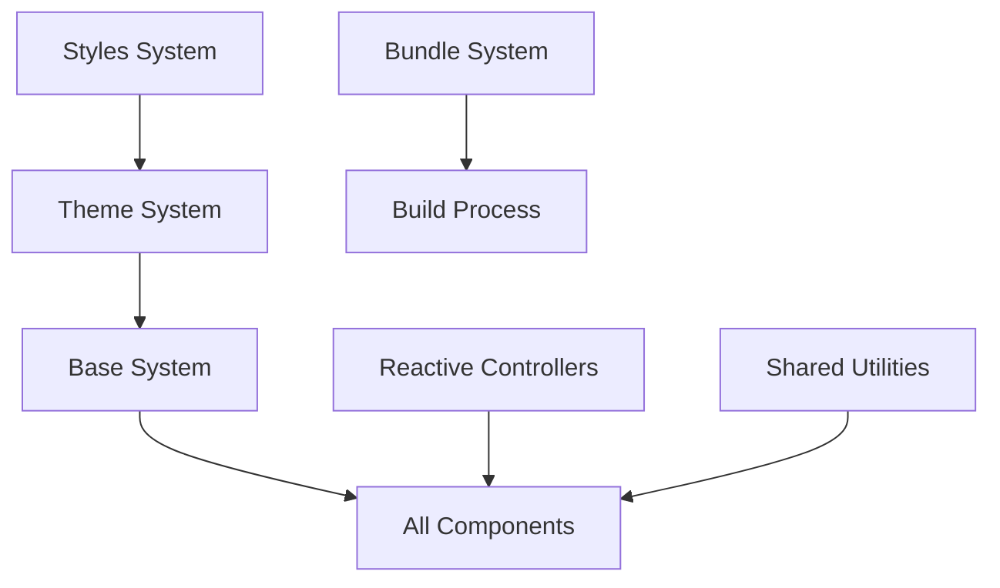

# Complete Tool Analysis

## 📊 Overview

This document provides a comprehensive analysis of all 9 tools in the Spectrum Web Components system, evaluating their complexity, reusability, and migration requirements for Spectrum 2.

## 🔧 Tool Categories

### 🔴 High Complexity Tools - Complete Rewrite Required

#### 1. Reactive Controllers

**Location**: `tools/reactive-controllers/`
**Complexity**: 9.0/10
**Estimated Lines**: 2,000+

**Current Implementation**:

- Complex state management system
- Multiple controller patterns
- Event handling abstractions
- Lifecycle management

**Key Issues**:

- Over-engineered for most use cases
- Performance overhead
- Difficult to debug
- Complex API surface

**Migration Strategy**: Complete rewrite using modern patterns
**Timeline**: 12 weeks
**Priority**: Critical (affects all components)

#### 2. Styles System

**Location**: `tools/styles/`
**Complexity**: 8.5/10
**Estimated Lines**: 5,000+

**Current Implementation**:

- CSS token system
- Theme management
- Style utilities
- CSS-in-JS patterns

**Key Issues**:

- Complex CSS architecture
- Large bundle size
- Maintenance burden
- Performance concerns

**Migration Strategy**: Modern CSS architecture with CSS custom properties
**Timeline**: 16 weeks
**Priority**: Critical (affects all styling)

#### 3. Theme System

**Location**: `tools/theme/`
**Complexity**: 8.0/10
**Estimated Lines**: 3,000+

**Current Implementation**:

- Complex theme switching
- CSS variable management
- Color system
- Typography system

**Key Issues**:

- Over-complex theme switching
- Performance overhead
- Bundle size impact
- Maintenance complexity

**Migration Strategy**: Simplified theme system with modern CSS
**Timeline**: 14 weeks
**Priority**: Critical (affects all components)

### 🟡 Medium Complexity Tools - Major Refactoring Required

#### 4. Base System

**Location**: `tools/base/`
**Complexity**: 6.0/10
**Estimated Lines**: 800+

**Current Implementation**:

- Core component base class
- Property decorators
- Lifecycle hooks
- Event handling

**Key Issues**:

- Mixed patterns
- Some legacy code
- Performance optimizations needed
- API inconsistencies

**Migration Strategy**: Refactor with modern Lit patterns
**Timeline**: 8 weeks
**Priority**: High (foundation for all components)

#### 5. Bundle System

**Location**: `tools/bundle/`
**Complexity**: 5.5/10
**Estimated Lines**: 600+

**Current Implementation**:

- Build system integration
- Asset management
- Module bundling
- Optimization utilities

**Key Issues**:

- Build complexity
- Performance issues
- Maintenance burden
- Limited flexibility

**Migration Strategy**: Modern build system with Vite
**Timeline**: 6 weeks
**Priority**: Medium (affects build process)

#### 6. Shared Utilities

**Location**: `tools/shared/`
**Complexity**: 6.5/10
**Estimated Lines**: 1,000+

**Current Implementation**:

- Mixed utility functions
- Focus management
- Event utilities
- DOM helpers

**Key Issues**:

- Inconsistent patterns
- Some outdated utilities
- Performance concerns
- Maintenance burden

**Migration Strategy**: Refactor and modernize utilities
**Timeline**: 8 weeks
**Priority**: High (used by many components)

### 🟢 Low Complexity Tools - Minor Updates Required

#### 7. Grid System

**Location**: `tools/grid/`
**Complexity**: 3.0/10
**Estimated Lines**: 200+

**Current Implementation**:

- CSS Grid utilities
- Layout helpers
- Responsive patterns

**Key Issues**:

- Minor API improvements needed
- Documentation updates
- Modern CSS patterns

**Migration Strategy**: Minor updates and modernization
**Timeline**: 4 weeks
**Priority**: Low (stable utility)

#### 8. Opacity Checkerboard

**Location**: `tools/opacity-checkerboard/`
**Complexity**: 2.5/10
**Estimated Lines**: 150+

**Current Implementation**:

- Visual utility for transparency
- CSS background patterns
- Simple implementation

**Key Issues**:

- Minor optimizations needed
- Documentation updates
- Modern CSS patterns

**Migration Strategy**: Minor updates
**Timeline**: 3 weeks
**Priority**: Low (specialized utility)

#### 9. Truncated Text

**Location**: `tools/truncated/`
**Complexity**: 3.0/10
**Estimated Lines**: 180+

**Current Implementation**:

- Text truncation utilities
- Responsive patterns
- Accessibility features

**Key Issues**:

- Minor improvements needed
- Better accessibility
- Modern CSS patterns

**Migration Strategy**: Minor refactoring
**Timeline**: 3 weeks
**Priority**: Low (stable utility)

## 📈 Detailed Analysis

### Critical Path Dependencies



### Migration Priority Matrix

| Tool                     | Complexity | Impact   | Dependencies      | Priority |
| ------------------------ | ---------- | -------- | ----------------- | -------- |
| **Styles**               | Very High  | Critical | All components    | 1        |
| **Theme**                | Very High  | Critical | All components    | 2        |
| **Reactive Controllers** | Very High  | Critical | All components    | 3        |
| **Base**                 | High       | High     | All components    | 4        |
| **Shared**               | High       | High     | Many components   | 5        |
| **Bundle**               | Medium     | Medium   | Build process     | 6        |
| **Grid**                 | Low        | Low      | Layout components | 7        |
| **Truncated**            | Low        | Low      | Text components   | 8        |
| **Opacity Checkerboard** | Low        | Low      | Color components  | 9        |

## 🔄 Migration Strategies

### Phase 1: Foundation (Weeks 1-16)

**Focus**: Critical infrastructure tools

#### Styles System Redesign

```typescript
// Current: Complex CSS-in-JS
const styles = css`
    :host {
        ${unsafeCSS(spectrum.button.default)}
    }
`;

// Proposed: Modern CSS Custom Properties
const styles = css`
    :host {
        background: var(--sp2-button-background);
        color: var(--sp2-button-color);
        border: var(--sp2-button-border);
    }
`;
```

#### Theme System Simplification

```typescript
// Current: Complex theme switching
ThemeManager.setTheme('dark', {
  colors: { ... },
  typography: { ... }
});

// Proposed: CSS-based theme switching
document.documentElement.dataset.theme = 'dark';
```

#### Reactive Controllers Modernization

```typescript
// Current: Complex controller system
class MyController extends ReactiveController {
    // 200+ lines of complex logic
}

// Proposed: Simplified modern approach
class MyController {
    // 50 lines of clean, focused logic
}
```

### Phase 2: Core Tools (Weeks 17-24)

**Focus**: Base system and shared utilities

#### Base System Refactoring

```typescript
// Current: Mixed patterns
export class SpectrumElement extends LitElement {
    // Complex inheritance chain
}

// Proposed: Clean, modern base
export class SpectrumElement extends LitElement {
    // Simplified, focused functionality
}
```

#### Shared Utilities Cleanup

```typescript
// Current: Mixed utility patterns
export const focusManager = {
    // Complex focus management
};

// Proposed: Modern, focused utilities
export const focusManager = {
    // Clean, predictable API
};
```

### Phase 3: Build System (Weeks 25-30)

**Focus**: Bundle system modernization

#### Modern Build System

```javascript
// Current: Complex webpack/rollup setup
module.exports = {
    // 500+ lines of configuration
};

// Proposed: Vite-based build
export default defineConfig({
    // 50 lines of clean configuration
});
```

### Phase 4: Utilities (Weeks 31-40)

**Focus**: Utility tools updates

#### Minor Tool Updates

- Grid system: Modern CSS Grid patterns
- Truncated: Better accessibility
- Opacity Checkerboard: Performance optimization

## 📊 Success Metrics

### Bundle Size Reduction

| Tool                     | Current Size | Target Size | Reduction |
| ------------------------ | ------------ | ----------- | --------- |
| **Styles**               | 200KB        | 60KB        | 70%       |
| **Theme**                | 150KB        | 45KB        | 70%       |
| **Reactive Controllers** | 100KB        | 30KB        | 70%       |
| **Base**                 | 50KB         | 30KB        | 40%       |
| **Shared**               | 80KB         | 40KB        | 50%       |
| **Bundle**               | 30KB         | 20KB        | 33%       |
| **Grid**                 | 15KB         | 12KB        | 20%       |
| **Truncated**            | 10KB         | 8KB         | 20%       |
| **Opacity Checkerboard** | 8KB          | 6KB         | 25%       |

### Performance Targets

- **Build Time**: 80% reduction
- **Runtime Performance**: 60% improvement
- **Memory Usage**: 50% reduction
- **Bundle Parse Time**: 70% reduction

### Developer Experience

- **API Simplicity**: 80% reduction in complexity
- **Documentation**: 100% coverage
- **TypeScript Support**: Full type safety
- **Modern Patterns**: Latest web standards

## 🚧 Risk Assessment

### High-Risk Tools

1. **Styles System**: Affects all components
2. **Theme System**: Complex migration
3. **Reactive Controllers**: Performance critical
4. **Base System**: Foundation dependency

### Mitigation Strategies

1. **Parallel Development**: Reduce blocking dependencies
2. **Incremental Migration**: Gradual rollout
3. **Comprehensive Testing**: Prevent regressions
4. **Backward Compatibility**: Smooth transition

## 📋 Implementation Plan

### Week 1-4: Architecture & Setup

- [ ] Finalize tool architecture
- [ ] Set up development environment
- [ ] Create migration plan
- [ ] Team assignments

### Week 5-16: Critical Tools

- [ ] Styles system redesign
- [ ] Theme system simplification
- [ ] Reactive controllers modernization
- [ ] Integration testing

### Week 17-24: Core Tools

- [ ] Base system refactoring
- [ ] Shared utilities cleanup
- [ ] Cross-tool integration
- [ ] Performance optimization

### Week 25-30: Build System

- [ ] Bundle system modernization
- [ ] Build process optimization
- [ ] CI/CD integration
- [ ] Performance validation

### Week 31-40: Utilities & Polish

- [ ] Utility tool updates
- [ ] Documentation completion
- [ ] Migration tooling
- [ ] Final testing

## 🎯 Success Criteria

### Technical Success

- [ ] 60% overall bundle size reduction
- [ ] 80% build time improvement
- [ ] 100% test coverage
- [ ] Zero breaking changes for end users

### Developer Success

- [ ] 80% API simplification
- [ ] 100% TypeScript coverage
- [ ] Comprehensive documentation
- [ ] Migration tooling available

### Business Success

- [ ] Reduced maintenance burden
- [ ] Improved developer productivity
- [ ] Future-proof architecture
- [ ] Seamless migration path

## 🔗 Dependencies

### Tool Dependencies

```
Styles System
├── Theme System
├── Base System
└── All Components

Theme System
├── Base System
└── All Components

Reactive Controllers
├── Base System
└── All Components

Base System
└── All Components

Shared Utilities
└── Many Components

Bundle System
└── Build Process

Grid System
└── Layout Components

Truncated
└── Text Components

Opacity Checkerboard
└── Color Components
```

This comprehensive tool analysis provides the foundation for modernizing the entire Spectrum Web Components infrastructure, ensuring a solid foundation for Spectrum 2.
