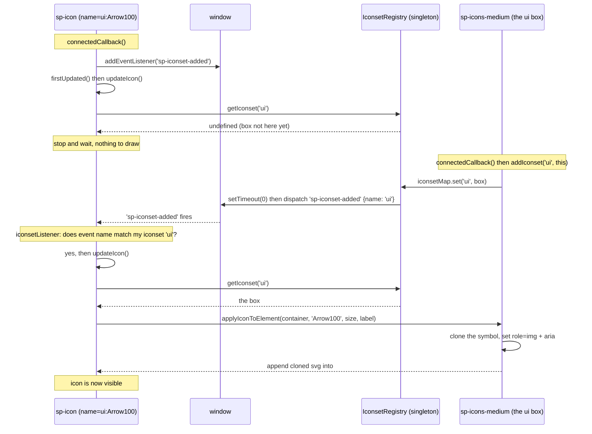

# The 1st-gen icon system, explained like you're 5

Imagine you have a **picture frame** and a big **box of stickers**. You put a
sticker in the frame, and now the frame shows that picture. The whole 1st-gen
icon system is just a fancy version of that idea, split across five little
toy boxes (npm packages).

```
1st-gen/packages/
├── icon              ← the picture frame  (<sp-icon>)
├── iconset           ← the rules for "boxes of stickers"  (old way, deprecated)
├── icons             ← one giant sticker sheet  (old way, deprecated)
├── icons-workflow    ← thousands of individual stickers you pick one-by-one (new way)
└── icons-ui          ← same as workflow, but tiny "machine parts" stickers (arrows, checks…)
```

---

## 1. The picture frame: `icon` (`<sp-icon>`)

`<sp-icon>` is the frame. By itself it's empty. You can fill it **three**
different ways, and it checks for them in this order:

1. **`name`** — "Go find the sticker called `ui:Arrow100` in one of the sticker
   boxes." (the old way)
2. **`src`** — "Here's a link to a picture file, show that." (renders an ``)
3. **A slotted SVG** — "I'll just hand you the drawing directly, hold it for me."

```html
<sp-icon name="ui:Arrow100"></sp-icon>
<!-- look it up by name -->
<sp-icon src="data:image/svg..."></sp-icon>
<!-- show an image -->
<sp-icon><svg>...</svg></sp-icon>
<!-- hold this drawing -->
```

### What the code actually does

There are two layers:

- **`IconBase`** (`icon/src/IconBase.ts`) — the bare frame. It knows about
  `size` (`s`, `m`, `l`, …) and `label`, and nothing else. Its whole job for
  drawing is literally just `<slot></slot>` — "show whatever someone hands me."
- **`Icon`** (`icon/src/Icon.ts`) — the smart frame. It adds `name` and `src`
  and the logic to go fetch a sticker by name.

Two small but important behaviors live in `IconBase`:

- **Accessibility auto-pilot.** If you give the icon a `label`, it removes
  `aria-hidden` (screen readers should announce it). If you _don't_, it sets
  `aria-hidden="true"` (it's just decoration, ignore it). You don't have to
  think about it; the frame does it for you.
- **It knows what "Spectrum version" it's in.** A helper
  (`SystemResolutionController`) tells it whether the surrounding app is using
  **Spectrum 1** or **Spectrum 2**. It remembers this as `spectrumVersion`
  (`1` or `2`). This matters a lot in section 4.

---

## 2. The old way: "boxes of stickers" (`iconset` + `icons`)

This is the **original** system, and it's now **deprecated** (being phased out).
But you need to understand it because lots of old code still uses it.

### `iconset` = the rulebook for sticker boxes

The `iconset` package doesn't contain any stickers. It contains the _rules_ for
what a "box of stickers" is, so other people can make their own.

The key trick is a single shared phone book called the **`IconsetRegistry`**
(`iconset/src/iconset-registry.ts`). There's exactly **one** of these for the
whole page (a "singleton"). It maps a name like `"ui"` to a box of stickers.

It works like a tiny announcement system:

1. You put a sticker box on the page. It shouts: "Hi! I'm the `ui` box!" and
   writes itself into the phone book. (It fires a `sp-iconset-added` event.)
2. Every `<sp-icon name="ui:something">` on the page is _listening_ for that
   shout. When it hears "`ui` box arrived!", it goes "oh good, now I can find
   my sticker," looks it up, and draws it.

This is why the README says to drop `<sp-icons-medium>` somewhere on your page —
that element _is_ a sticker box announcing itself.

#### The event flow, step by step

The tricky part is **timing**: an `<sp-icon>` and its sticker box can show up on
the page in _either_ order. The system handles both. Here's the "box arrives
second" case (the harder one), which is why the announcement system exists at
all:



A few details that make this work:

- **The `setTimeout(0)`** in `addIconset` is deliberate. The box delays its
  shout by one tick so its own slotted SVG has finished parsing before any icon
  tries to read a sticker out of it.
- **The filter check.** When an icon hears `sp-iconset-added`, it only reacts if
  `event.detail.name` matches _its_ iconset (`ui`). An icon waiting on the `ui`
  box ignores some other box arriving.
- **The "box arrives first" case is simpler.** If the box is already registered
  when the icon's `firstUpdated()` runs, `getIconset('ui')` returns it
  immediately and the icon draws right away — no event needed.
- **Removal mirrors this.** When a box leaves the page, `disconnectedCallback()`
  → `removeIconset()` fires `sp-iconset-removed`, and the registry forgets it.

### `IconsetSVG` = a box that holds one giant sticker sheet

The most common kind of box (`iconset/src/iconset-svg.ts`) is built from **one
big SVG "sprite sheet."** Think of a sheet of stickers where each sticker is a
`<symbol>` with an `id`. The box reads all the `<symbol>`s into a map
(`id → sticker`).

When an icon asks for a sticker, the box **clones** that one symbol, wraps it in
a fresh `<svg>`, sets `role="img"` plus the label/`aria-hidden`, and hands the
copy to the frame (`applyIconToElement`). It clones because one SVG can't be in
two places at once across shadow DOM boundaries.

### `icons` = the actual sticker sheets Adobe ships

The `icons` package is just two ready-made sticker-sheet boxes:

- **`<sp-icons-medium>`** → registers itself under the name **`ui`**
- **`<sp-icons-large>`** → the large set

That's why the example earlier used `name="ui:Arrow100"`.

### Why this old way is being thrown out

One giant sticker sheet means: even if your app uses **3** icons, you ship
**all 500+** to your users. That's wasteful. So both `iconset` and `icons` print
a deprecation warning and tell you to use the new way below.

---

## 3. The new way: pick stickers one at a time (`icons-workflow`, `icons-ui`)

Instead of one giant sheet, the new packages give you **every icon as its own
tiny file**. You import only the ones you use, and your build tool
("tree-shaking") throws away the rest. Small bundles, happy users.

- **`icons-workflow`** = the big general-purpose Spectrum icons.
- **`icons-ui`** = the little "machine part" icons the components need.

Each icon comes in **three flavors** (all generated by a script):

- **Flavor A — a factory function** (`AbcIcon()`): returns the SVG markup. It uses
  a swappable template tag (`custom-tag.ts`): by default it glues strings into
  plain SVG text, but `setCustomTemplateLiteralTag(html)` makes it produce a lit
  template, or a Preact/React node. Same file, any framework.
- **Flavor B — a base class** (`IconAbc`): wraps the function in a class extending
  `IconBase`, so it behaves like a real icon (size, label, a11y).
- **Flavor C — a ready-to-use element** (`<sp-icon-abc>`): calls
  `defineElement('sp-icon-abc', IconAbc)`. Import one file, write the tag.

---

## 4. The magic trick: one icon, two Spectrum versions

The new icon elements ship **both** Spectrum 1 and Spectrum 2 art and pick the
right one automatically:

```ts
import { AbcIcon as CurrentIcon }   from '../icons-s2/ABC.js'; // Spectrum 2 drawing
import { AbcIcon as AlternateIcon } from '../icons/ABC.js';    // Spectrum 1 drawing

export class IconAbc extends IconBase {
  protected render() {
    if (this.spectrumVersion === 2) return CurrentIcon(...);  // app is S2 → new art
    return AlternateIcon(...);                                 // app is S1 → old art
  }
}
```

- `src/icons/` holds the **Spectrum 1** drawings; `src/icons-s2/` holds **Spectrum 2**.
- `spectrumVersion` decides which to show, live, based on the app.
- If an icon exists in only one version, the build falls back to a generic
  placeholder circle (`DefaultIcon.ts`). A small `icons-mapping.json` handles
  icons whose name changed between S1 and S2 (e.g. `UnLink` → `Unlink`).

---

## 5. Where do all these files come from? (the generator)

Nobody hand-writes thousands of icon files. A build script
(`icons-workflow/bin/build.js`) does it.

#### Where the raw drawings come from

The drawings are pulled from published **upstream Adobe npm packages**:

- **Workflow icons:** `@adobe/spectrum-css-workflow-icons` (its own repo).
- **UI icons:** `@spectrum-css/ui-icons` (part of the `adobe/spectrum-css`
  monorepo, `spectrum-two` branch).

The "two versions" trick is an **npm alias**: the same package is installed twice
at two versions.

```jsonc
"@adobe/spectrum-css-workflow-icons": "1.7.0",                               // S1 art
"@adobe/spectrum-css-workflow-icons-s2": "npm:@adobe/spectrum-css-workflow-icons@5.0.0", // S2 art
```

The build reads S1 art from `dist/18` and S2 art from `dist/assets/svg`. (UI
icons do the same: `@spectrum-css/ui-icons@1.1.2` for S1 and
`npm:@spectrum-css/ui-icons@2.0.0-s2-foundations.10` for S2, both `dist/medium`.)
Both public packages are themselves generated from Adobe-employees-only icon sets.

#### What the cleanup step actually changes

For each raw SVG the script:

1. **Strips** `id`, `class`, and `<defs>`.
2. **Forces `currentColor`.** This makes every icon take its color from CSS
   `color`. The two families start from different places:
   - **Workflow** S2 SVGs fill with CSS custom properties, e.g.
     `fill="var(--iconPrimary, #222)"`. The build throws that theming away.
   - **UI** S2 SVGs ship **with no fill attribute at all**, so the build simply
     adds `currentColor`.
3. **Parameterizes** size and a11y (`width`/`height`/`aria-hidden`/`aria-label`).
4. **Note the base size, and that it varies.** S2 **workflow** icons are `20×20`
   (`viewBox 0 0 20 20`); S1 workflow icons were `36×36`. **UI** icons do not
   share one box: each has its own small viewBox (e.g. `Arrow75` is `0 0 10 10`)
   with size-suffixed names (`Arrow75`, `Arrow100`, `Chevron200`).

Then it writes all three flavors plus an export index and a searchable manifest.
So those folders full of `.ts` files are **generated output**, not source you
edit by hand. You change the generator (or bump the upstream versions), then
regenerate.

---

## 6. Colors, sizes, and accessibility (the small print)

- **Color:** icons draw with `fill="currentColor"`, so you color them with plain
  CSS: `<sp-icon style="color: red">`.
- **Size:** `size="s|m|l|xl|xxl"` (default behaves like `m`). Note: `xxs` and
  `xxl` are deprecated and warn you to use `xs`/`xl` in Spectrum 2.
- **Accessibility, the one rule to remember:**
  - Icon is **decoration** → give it **no** label; it's auto-hidden from screen
    readers (`aria-hidden="true"`).
  - Icon **means something** → give it a **`label`**; that becomes its
    `aria-label` and it becomes visible to screen readers.

---

## The whole thing in one breath

`<sp-icon>` is an empty frame. The **old** way (`icons` + `iconset`) drops a
giant sticker sheet on the page, registers it in a shared phone book by name,
and frames look stickers up by `name="box:sticker"` — simple, but ships every
icon whether you use it or not, so it's deprecated. The **new** way
(`icons-workflow`, `icons-ui`) ships each icon as its own tiny tree-shakeable
file in three flavors (factory function, class, ready-made `<sp-icon-name>`
element), carries both Spectrum 1 and Spectrum 2 art, and auto-picks the right
one based on the app's Spectrum version. All those icon files are machine-
generated from Adobe's raw SVGs by `bin/build.js`.
